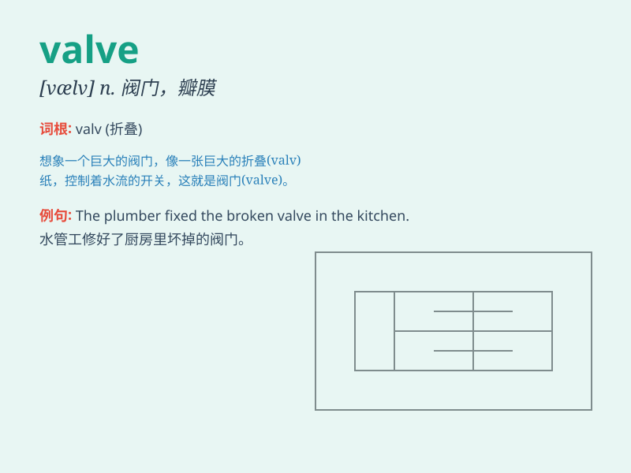

## valve

**英音:** _[vælv]_ **美音:** _[vælv]_

**译义:** *n.阀,[英] 电子管,真空管*

### 短语

+ **safety valve:** _安全阀；安全活门_

+ **control valve:** _控制阀；调节阀_

+ **inlet valve:** _进气阀；入口阀_

+ **exhaust valve:** _排气阀_

+ **valve spring:** _阀簧；气门弹簧_

### 例句

#### 例句1

> **The valve in the pipe needs to be replaced.**

**中文翻译:** 管道中的阀门需要更换。

**单词释义:** 阀门

#### 例句2

> **He opened the valve to let the water flow.**

**中文翻译:** 他打开阀门让水流出来。

**单词释义:** 阀门

#### 例句3

> **The heart valve functions improperly.**

**中文翻译:** 心脏瓣膜功能不正常。

**单词释义:** 瓣膜

### 背诵小故事

> One day, Tom was in a factory. He saw a strange device that
controlled the flow of liquid. The worker told him it was a \'valve\'.
By opening or closing the valve, the liquid flow could be managed.

**有一天，汤姆在一家工厂里。他看到一个控制液体流动的奇怪装置。工人告诉他这是一个"阀门"。通过打开或关闭阀门，可以管理液体的流动。**

### 图义

