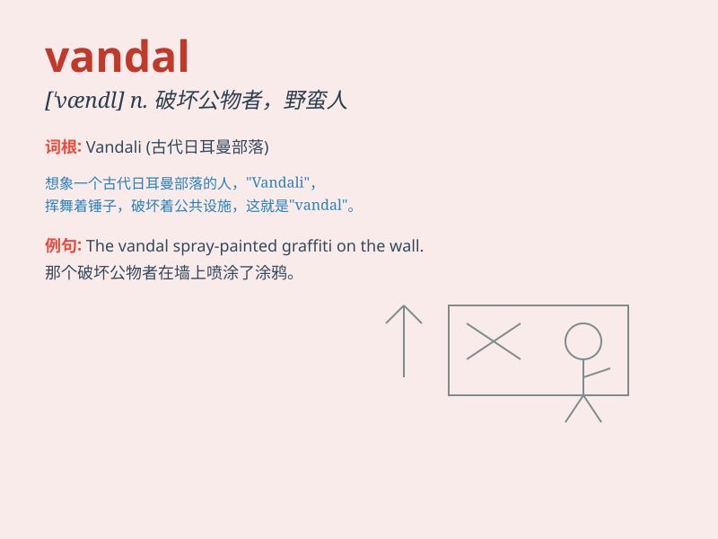

## vandal

**英音:** _[ˈvændl]_ **美音:** _[ˈvændl]_

**译义:**
*n.汪达尔人,文化艺术的破坏者,野蛮人adj.汪达尔人的,破坏文化艺术的*

### 短语

+ **vandal damage:** _故意破坏造成的损害_

+ **vandal act:** _破坏行为_

+ **vandal proof:** _防破坏的_

+ **vandal attack:** _破坏袭击_

+ **vandal gang:** _破坏团伙_

### 例句

#### 例句1

> **The vandals defaced the public building with graffiti.**

**中文翻译:** 破坏者在公共建筑上乱涂乱画。

**单词释义:** 破坏者

#### 例句2

> **The park was vandalized last night and several benches were
broken.**

**中文翻译:** 公园昨晚遭到破坏，几张长椅被弄坏了。

**单词释义:** 进行破坏的人

#### 例句3

> **The vandals caused extensive damage to the school property.**

**中文翻译:** 这些破坏者对学校财产造成了广泛的损害。

**单词释义:** 故意破坏他人财物者

### 背诵小故事

>
想象一下，在一个宁静的夜晚，一群野蛮的人闯进了博物馆，肆意破坏珍贵的展品。这些毫无顾忌搞破坏的人就是'vandal'，也就是'故意破坏他人财产者；汪达尔人'。

**想象一群肆意破坏者闯进博物馆的场景来记住'vandal'意为故意破坏他人财产者、汪达尔人**

### 图义

