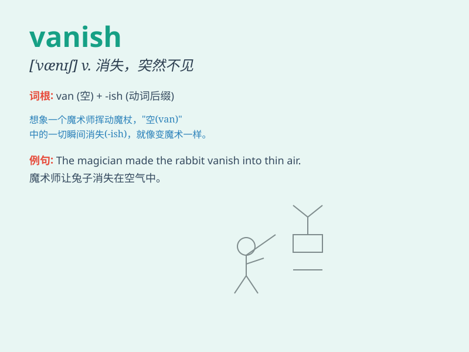

## vanish

**英音:** _[\'vænɪʃ]_ **美音:** _[\'vænɪʃ]_

**译义:** *vi.消失,突然不见,[数]成为零n.[语]弱化音*

### 短语

+ **vanish away:** _消失；消散_

+ **vanish from sight:** _从视线中消失_

+ **vanish without a trace:** _消失得无影无踪_

+ **vanish into thin air:** _突然消失；不知去向_

+ **vanish completely:** _完全消失_

### 例句

#### 例句1

> **The magician made the rabbit vanish into thin air.**

**中文翻译:** 魔术师让兔子消失得无影无踪。

**单词释义:** 消失

#### 例句2

> **Hope seemed to vanish when they received the bad news.**

**中文翻译:** 当他们收到这个坏消息时，希望似乎消失了。

**单词释义:** 消失；破灭

#### 例句3

> **The smile vanished from her face when she heard the
criticism.**

**中文翻译:** 当她听到批评时，笑容从她脸上消失了。

**单词释义:** 消失

### 背诵小故事

> One day, a magician performed on the stage. He put a rabbit in a box
and with a wave of his wand, the rabbit vanished. Everyone was amazed.
It was as if the rabbit had disappeared into thin air.

**有一天，一位魔术师在舞台上表演。他把一只兔子放进一个盒子里，然后挥动魔杖，兔子就消失了。所有人都很惊讶。就好像兔子凭空消失了一样。**

### 图义

