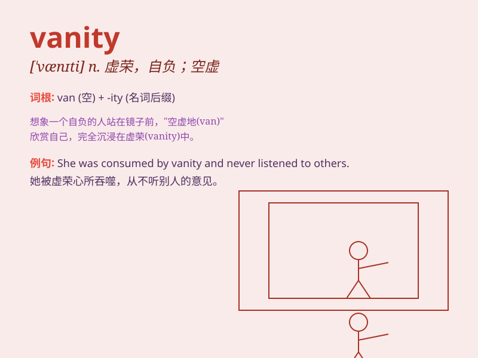

## vanity

**英音:** _[ˈvænəti]_ **美音:** _[\'vænəti]_

**译义:** *n.空虚*

### 短语

+ **vanity mirror:** _梳妆镜_

+ **vanity case:** _化妆盒_

+ **vanity fair:** _浮华世界；虚荣无聊的社会_

+ **vanity project:** _形象工程；徒有其表的项目_

+ **vanity plate:** _（汽车）个性化车牌_

### 例句

#### 例句1

> **Her vanity knows no bounds; she spends hours in front of the
mirror every day.**

**中文翻译:** 她的虚荣心没有止境；她每天都要在镜子前花好几个小时。

**单词释义:** 虚荣心

#### 例句2

> **The room was filled with all kinds of vanity items, like perfume
and jewelry.**

**中文翻译:** 房间里摆满了各种虚荣的物品，比如香水和珠宝。

**单词释义:** 虚荣的物品

#### 例句3

> **He recognized the vanity of his pursuit of fame and fortune.**

**中文翻译:** 他认识到自己对名利的追求是虚荣的。

**单词释义:** 虚荣

### 背诵小故事

> A vain girl always looked at herself in the mirror, caring only about
her appearance. She spent all her money on fancy clothes and makeup. Her
vanity made her lose true friends.

**一个自负的女孩总是照镜子，只关心自己的外表。她把所有的钱都花在漂亮衣服和化妆品上。她的虚荣心使她失去了真正的朋友。**

### 图义

