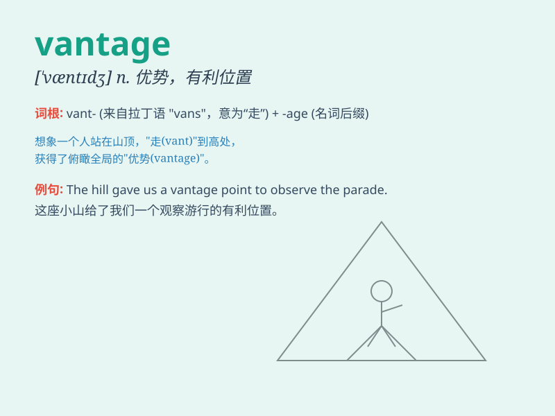

## vantage

**英音:** _[\'vɑːntɪdʒ]_ **美音:** _[\'væntɪdʒ]_

**译义:** *n.优势,有利情况*

### 短语

+ **vantage point:** _有利位置；优势；观点_

+ **competitive vantage:** _竞争优势_

+ **strategic vantage:** _战略优势_

+ **take vantage of:** _利用_

+ **vantage ground:** _有利地位；优越地位_

### 例句

#### 例句1

> **From this vantage point, you can see the entire city.**

**中文翻译:** 从这个有利位置，你可以看到整个城市。

**单词释义:** 有利位置；优势

#### 例句2

> **He took advantage of every vantage to improve his situation.**

**中文翻译:** 他利用每一个优势来改善自己的处境。

**单词释义:** 优势；有利条件

#### 例句3

> **The team has the vantage of a strong defense.**

**中文翻译:** 这个团队具有强大防守的优势。

**单词释义:** 优势；长处

### 背诵小故事

> A young adventurer climbed to the top of a mountain. Standing there,
he had a vantage point and could see the beautiful landscape far away.
It was a wonderful place that gave him a clear view.

**一位年轻的冒险家爬上了山顶。站在那里，他有一个有利位置，能够看到远处美丽的风景。这是一个能让他视野清晰的绝妙之处。**

### 图义

