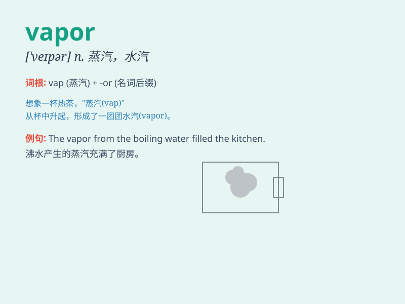

## vapor

**英音:** _[ˈveɪpə(r)]_ **美音:** _[ˈveɪpər]_

**译义:** *n.水汽,水蒸气,无实质之物vi.蒸发,自夸vt.使蒸发n.自夸者*

### 短语

+ **water vapor:** _水蒸气_

+ **vapor pressure:** _蒸汽压_

+ **vapor trail:** _蒸汽尾迹_

+ **chemical vapor:** _化学蒸汽_

+ **vapor phase:** _汽相_

### 例句

#### 例句1

> **The vapor from the boiling water filled the room.**

**中文翻译:** 沸水产生的蒸汽充满了房间。

**单词释义:** 蒸汽

#### 例句2

> **The chemical reaction produced a lot of harmful vapors.**

**中文翻译:** 这个化学反应产生了许多有害的蒸气。

**单词释义:** 蒸气

#### 例句3

> **The morning mist was just a vapor that soon dissipated.**

**中文翻译:** 早晨的薄雾只是一团很快消散的水汽。

**单词释义:** 水汽

### 背诵小故事

> One hot summer day, I was sweating a lot. When I looked up, I saw
water turning into vapor rising from a boiling pot. The vapor was like a
mysterious cloud, disappearing into the air.

**在一个炎热的夏日，我汗流浃背。当我抬头看时，看到水从沸腾的锅里变成蒸汽升起。蒸汽就像神秘的云，消失在空气中。**

### 图义

