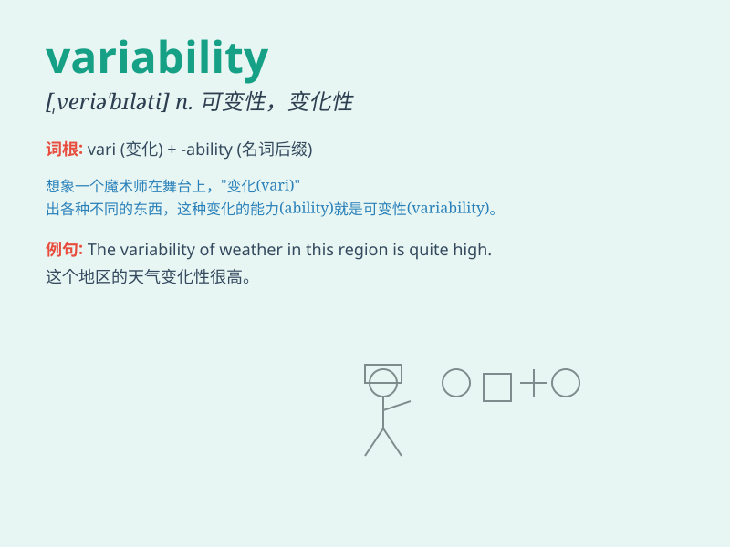

## variability

**英音:** _[,veərɪə\'bɪlətɪ]_ **美音:**
_[,vɛrɪə\'bɪləti]_

**译义:** *n.可变性*

### 短语

+ **coefficient of variability:** _变异系数_

+ **environmental variability:** _环境变异_

+ **genetic variability:** _遗传变异性_

+ **temporal variability:** _时间变异性_

+ **spatial variability:** _空间变异性_

### 例句

#### 例句1

> **The variability of the weather makes it difficult to plan outdoor
activities.**

**中文翻译:** 天气的多变性使得规划户外活动变得困难。

**单词释义:** 多变性；易变性

#### 例句2

> **There is a high degree of variability in student performance on
this exam.**

**中文翻译:** 在这次考试中学生的表现有很大的差异性。

**单词释义:** 差异性；变化程度

#### 例句3

> **The variability of the stock market can lead to significant
financial losses.**

**中文翻译:** 股市的变化无常可能导致重大的财务损失。

**单词释义:** 变化无常；不稳定性

### 背诵小故事

> A scientist was studying the weather. He found that the temperature
had a lot of variability. One day it was hot, and the next it was cold.
This showed him how unpredictable and changeable things could be, just
like \'variability\'.

**一位科学家在研究天气。他发现温度有很多变化。一天很热，第二天又很冷。这向他展示了事物是多么不可预测和多变，就像\'variability\'这个词一样。**

### 图义

