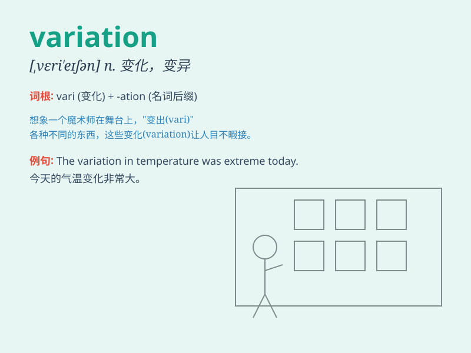

## variation

**英音:** _[veərɪ\'eɪʃ(ə)n]_ **美音:** _[,vɛrɪ\'eʃən]_

**译义:** *n.变更,变化,变异,变种,[音]变奏,变调*

### 短语

+ **genetic variation:** _遗传变异_

+ **seasonal variation:** _季节变化_

+ **regional variation:** _地区差异_

+ **slight variation:** _细微变化_

+ **price variation:** _价格变动_

### 例句

#### 例句1

> **There is a wide variation in temperature across the region.**

**中文翻译:** 这个地区的温度有很大的变化。

**单词释义:** 变化；变异

#### 例句2

> **This dance performance shows several variations of the basic
steps.**

**中文翻译:** 这场舞蹈表演展示了基本舞步的几种变化。

**单词释义:** 变化；变体

#### 例句3

> **The new model is just a variation of the old one.**

**中文翻译:** 新模型只是旧模型的一个变体。

**单词释义:** 变体；变种

### 背诵小故事

> A king had many treasures. One day, he noticed a variation in the
number of jewels. Some were missing. After an investigation, it was
found that a thief had stolen them, causing this change.

**一位国王拥有许多财宝。有一天，他注意到珠宝的数量有变化。一些不见了。经过调查，发现是一个小偷偷走了它们，导致了这种改变。**

### 图义

