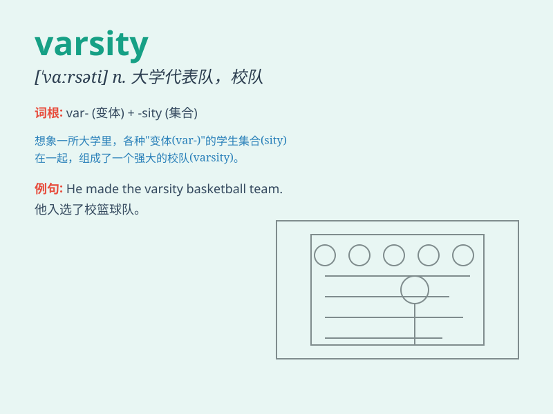

## varsity

**英音:** _[\'vɑːsɪtɪ]_ **美音:** _[\'vɑrsəti]_

**译义:** *n.大学运动代表队,大学adj.大学代表队的*

### 短语

+ **varsity team:** _校队_

+ **varsity athlete:** _校队运动员_

+ **varsity jacket:** _校队夹克_

+ **varsity sports:** _校际体育活动_

+ **varsity match:** _校际比赛_

### 例句

#### 例句1

> **He was a star player on the varsity basketball team.**

**中文翻译:** 他是大学体育代表队篮球队的明星球员。

**单词释义:** 大学体育代表队

#### 例句2

> **She made the varsity volleyball squad this year.**

**中文翻译:** 她今年进入了大学排球代表队。

**单词释义:** 大学体育代表队

#### 例句3

> **The varsity football game attracted a large crowd.**

**中文翻译:** 这场大学体育代表队的足球比赛吸引了大批观众。

**单词释义:** 大学体育代表队

### 背诵小故事

> In a small town, there was a big sports competition. The best team
was from the varsity. They trained hard and always won. Varsity means a
university or college team representing the institution in sports and
other activities.

**在一个小镇上，有一场大型体育比赛。最好的队伍来自校队。他们训练刻苦，总是获胜。varsity
指代表大学或学院参加体育和其他活动的团队。**

### 图义

