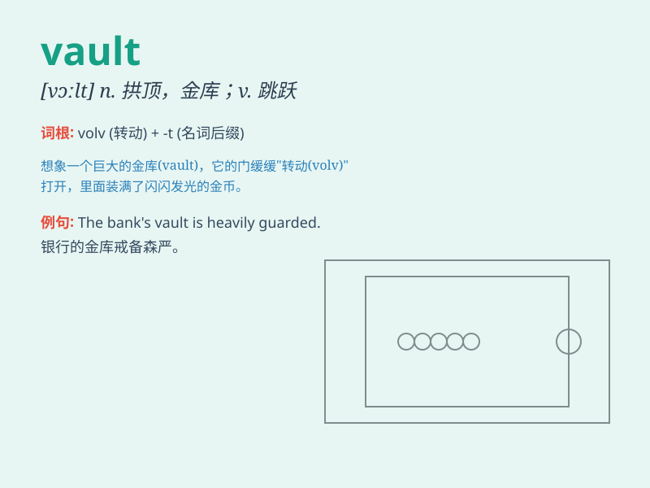

## vault

**英音:** _[vɔːlt]_ **美音:** _[vɔlt]_

**译义:** *n.拱顶*

### 短语

+ **vault over:** _跳过；越过_

+ **vault ceiling:** _拱顶天花板_

+ **bank vault:** _银行金库_

+ **vault storage:** _拱顶储存_

+ **vault door:** _保险库门_

### 例句

#### 例句1

> **The athlete cleared the vault with ease.**

**中文翻译:** 这位运动员轻松越过了跳马。

**单词释义:** 跳马

#### 例句2

> **He broke into the bank vault and stole a large amount of
money.**

**中文翻译:** 他闯进银行保险库，偷了一大笔钱。

**单词释义:** 保险库；金库

#### 例句3

> **The cat vaulted over the fence and disappeared.**

**中文翻译:** 那只猫跳过围栏消失了。

**单词释义:** 跳跃；撑杆跳过

### 背诵小故事

> A thief wanted to steal the treasure in the vault. He climbed over
the wall but was caught by the guards. The vault was so secure that no
one could break in easily.

**一个小偷想偷保险库中的财宝。他翻墙进去但被守卫抓住了。这个保险库非常安全，没人能轻易闯入。**

### 图义

