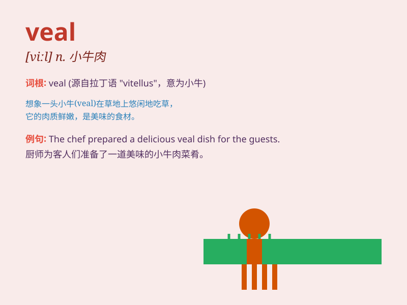

## veal

**英音:** _[viːl]_ **美音:** _[vil]_

**译义:** *n.小牛肉,幼小的菜牛vt.宰小牛*

### 短语

+ **veal cutlet:** _小牛肉排_

+ **veal steak:** _小牛肉牛排_

+ **veal parmigiana:** _帕尔马干酪小牛肉_

+ **veal scallopini:** _薄切小牛肉片_

+ **veal marsala:** _马沙拉酒烩小牛肉_

### 例句

#### 例句1

> **I ordered a plate of veal for dinner.**

**中文翻译:** 我晚餐点了一盘小牛肉。

**单词释义:** 小牛肉

#### 例句2

> **The chef prepared a delicious veal stew.**

**中文翻译:** 厨师准备了一道美味的小牛肉炖菜。

**单词释义:** 小牛肉

#### 例句3

> **She doesn\'t like the taste of veal.**

**中文翻译:** 她不喜欢小牛肉的味道。

**单词释义:** 小牛肉

### 背诵小故事

> A little calf was very sad because it knew it would become veal. But
a kind farmer decided to let it grow freely. So, veal is the meat of a
calf.

**一只小牛犊非常伤心，因为它知道自己会变成小牛肉。但一位善良的农夫决定让它自由生长。所以，veal
就是小牛的肉。**

### 图义

