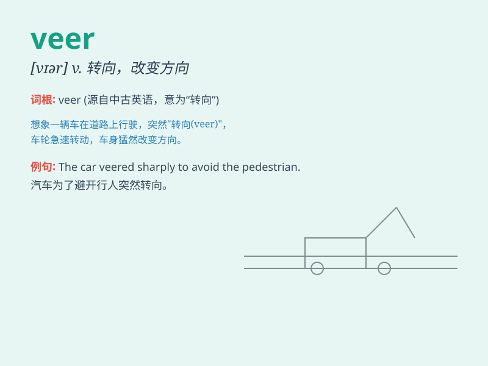

## veer

**英音:** _[vɪə]_ **美音:** _[vɪr]_

**译义:**
*vi.转向,(风向)顺(时针)转vt.使转向,放出(锚)n.转向,方向的转变*

### 短语

+ **veer off:** _突然转向；偏离_

+ **veer away:** _转向离开；避开_

+ **veer towards:** _转向；朝向_

+ **veer sharply:** _急剧转向_

+ **veer gradually:** _逐渐转向_

### 例句

#### 例句1

> **The wind veered to the north.**

**中文翻译:** 风转向了北方。

**单词释义:** 改变方向；转向

#### 例句2

> **His mood veered from optimism to pessimism.**

**中文翻译:** 他的情绪从乐观变成了悲观。

**单词释义:** 突然改变；转变

#### 例句3

> **The car veered off the road and hit a tree.**

**中文翻译:** 汽车突然偏离道路，撞上了一棵树。

**单词释义:** 突然偏离

### 背诵小故事

> A brave pilot was flying a plane. Suddenly, a strong wind came. The
plane had to veer to avoid a storm. It changed direction quickly and
safely. Just like the plane, veer means to change direction suddenly.

**一位勇敢的飞行员正在驾驶飞机。突然，一阵强风袭来。飞机不得不转向以避开暴风雨。它迅速改变了方向并且安全了。就像这架飞机一样，veer
意思是突然改变方向。**

### 图义

