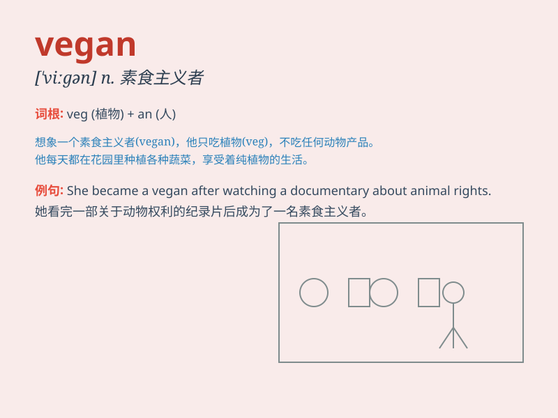

## vegan

**英音:** _[\'viːg(ə)n]_ **美音:** _[\'viɡən]_

**译义:** *n.严格的素食主义者*

### 短语

+ **vegan diet:** _纯素食饮食_

+ **vegan lifestyle:** _纯素食生活方式_

+ **vegan food:** _纯素食食品_

+ **vegan restaurant:** _纯素食餐厅_

+ **strict vegan:** _严格的纯素食者_

### 例句

#### 例句1

> **I have decided to become a vegan for ethical reasons.**

**中文翻译:** 出于道德原因，我决定成为一名纯素食者。

**单词释义:** 纯素食者

#### 例句2

> **The restaurant offers a wide range of vegan options.**

**中文翻译:** 这家餐厅提供各种各样的纯素食选择。

**单词释义:** 纯素食的

#### 例句3

> **My sister has been a vegan for several years and she\'s very
healthy.**

**中文翻译:** 我的姐姐成为纯素食者已经好几年了，她非常健康。

**单词释义:** 纯素食者

### 背诵小故事

> One day, Tom decided to become a vegan. He refused to eat any food
from animals. Instead, he enjoyed fruits, vegetables, and grains. Now,
he\'s healthy and happy.

**有一天，汤姆决定成为一个纯素食者。他拒绝吃任何来自动物的食物。相反，他喜欢水果、蔬菜和谷物。现在，他健康又快乐。**

### 图义

