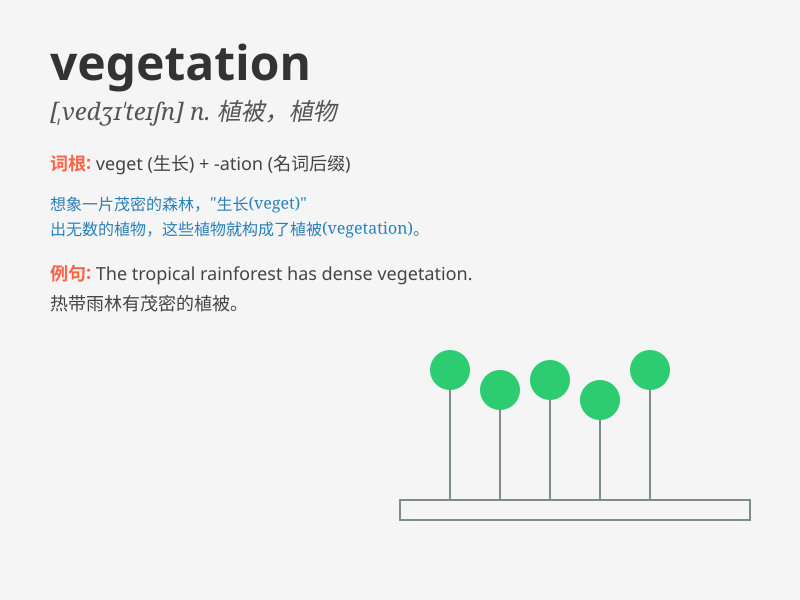

## vegetation

**英音:** _[vedʒɪ\'teɪʃ(ə)n]_ **美音:**
_[\'vɛdʒə\'teʃən]_

**译义:**
*n.[植]植被,(总称)植物、草木,(植物的)生长、呆板单调的生活*

### 短语

+ **natural vegetation:** _自然植被_

+ **dense vegetation:** _茂密的植被_

+ **tropical vegetation:** _热带植被_

+ **sparse vegetation:** _稀疏的植被_

+ **native vegetation:** _本土植被_

### 例句

#### 例句1

> **The area is rich in diverse vegetation.**

**中文翻译:** 这个地区有着丰富多样的植被。

**单词释义:** 植被

#### 例句2

> **The drought has severely affected the local vegetation.**

**中文翻译:** 干旱严重影响了当地的植被。

**单词释义:** 植被

#### 例句3

> **They are studying the types of vegetation in the rainforest.**

**中文翻译:** 他们正在研究雨林中的植被类型。

**单词释义:** 植被

### 背诵小故事

> Once upon a time, a little explorer was lost in a strange land. He
was very hungry and thirsty. Then he found a place full of various
plants. These plants, called vegetation, saved him.

**从前，有个小探险家在一片陌生的土地上迷路了。他又饿又渴。然后他发现了一个到处都是各种各样植物的地方。这些被称为植被的植物救了他。**

### 图义

