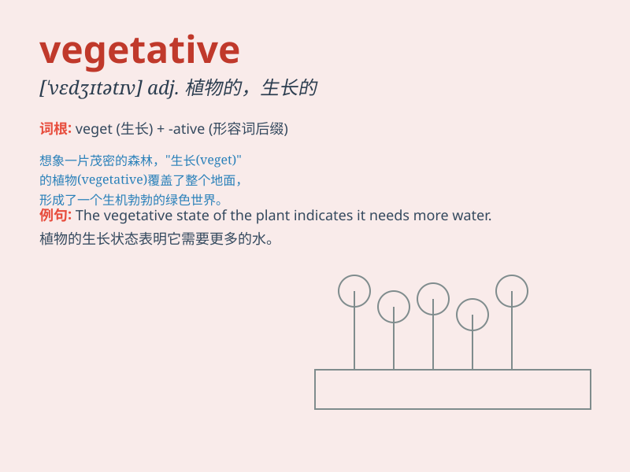

## vegetative

**英音:** _[\'vedʒɪtətɪv; -teɪtɪv]_ **美音:**
_[\'vɛdʒə\'tetɪv]_

**译义:** *adj.有关植物生长的,植物的,有生长力的,生活呆板单调*

### 短语

+ **vegetative reproduction:** _营养生殖；无性生殖_

+ **vegetative state:** _植物人状态_

+ **vegetative growth:** _营养生长_

+ **vegetative cell:** _营养细胞_

+ **vegetative cover:** _植被；植物覆盖_

### 例句

#### 例句1

> **After the accident, he fell into a vegetative state and showed no
sign of consciousness.**

**中文翻译:** 事故发生后，他陷入了植物人状态，没有任何意识的迹象。

**单词释义:** 植物人的；植物性的

#### 例句2

> **The patient\'s recovery was slow and mainly vegetative at
first.**

**中文翻译:** 病人的康复很慢，起初主要是植物性的恢复。

**单词释义:** 植物性的

#### 例句3

> **Some plants have a vegetative reproduction method that allows
them to multiply rapidly.**

**中文翻译:** 一些植物有一种营养繁殖的方法，使它们能够迅速繁殖。

**单词释义:** 营养生长的；无性生殖的

### 背诵小故事

> Imagine a garden full of plants. The plants grow and just focus on
basic life processes like absorbing sunlight and water. This state of
the plants is like being \'vegetative\'. It means related to the simple
processes of growth and survival.

**想象一个满是植物的花园。这些植物生长着，只专注于吸收阳光和水分等基本生命过程。植物的这种状态就像是处于\'vegetative（植物生长的；植物人的）\'。它意味着与简单的生长和生存过程有关。**

### 图义

