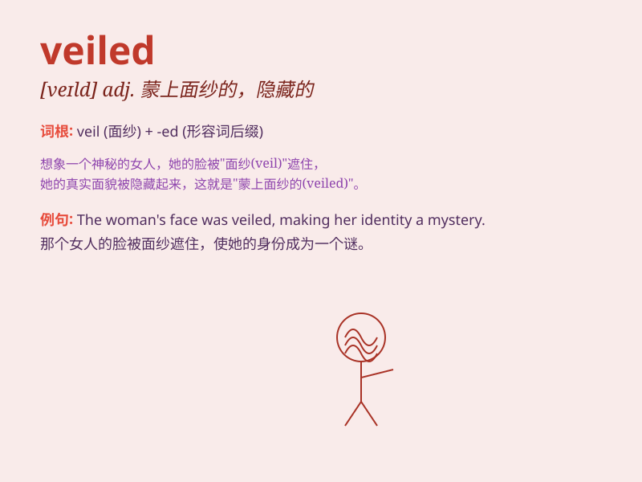

## veiled

**英音:** _[veɪld]_ **美音:** _[veld]_

**译义:** *adj.以面罩遮掩的,隐藏的*

### 短语

+ **veiled threat:** _含蓄的威胁_

+ **veiled criticism:** _含蓄的批评_

+ **veiled allusion:** _隐晦的暗示_

+ **veiled reference:** _含蓄的提及_

+ **veiled compliment:** _委婉的称赞_

### 例句

#### 例句1

> **She wore a veiled hat to the party.**

**中文翻译:** 她戴着一顶有面纱的帽子去参加聚会。

**单词释义:** 有面纱的

#### 例句2

> **His comments were veiled criticism of the management.**

**中文翻译:** 他的评论是对管理层的含蓄批评。

**单词释义:** 含蓄的

#### 例句3

> **The threat was veiled but still menacing.**

**中文翻译:** 威胁是隐晦的，但仍然具有威胁性。

**单词释义:** 隐晦的

### 背诵小故事

> A princess wore a veiled hat to hide her face. When she took off the
hat, people were amazed by her beauty. The veil made her look
mysterious. Remember, \'veiled\' means covered or hidden partially.

**一位公主戴着一顶有面纱的帽子来遮住她的脸。当她摘下帽子时，人们都为她的美丽而惊叹。面纱使她看起来很神秘。记住，'veiled'意思是部分被遮盖或隐藏。**

### 图义

