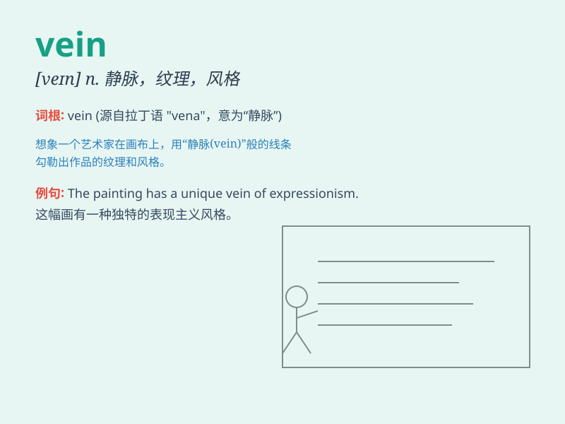

## vein

**英音:** _[veɪn]_ **美音:** _[ven]_

**译义:**
*n.血管,静脉,叶脉,翅脉,矿脉,纹理,性情,心绪vt.使成脉络,象脉络般分布于*

### 短语

+ **blue vein:** _青筋_

+ **in the vein of:** _类似于；与\...\...风格相同_

+ **vein deposit:** _脉矿床_

+ **portal vein:** _门静脉_

+ **saphenous vein:** _隐静脉_

### 例句

#### 例句1

> **The doctor examined the patient\'s veins.**

**中文翻译:** 医生检查了病人的静脉。

**单词释义:** 静脉

#### 例句2

> **He has a vein of creativity in him.**

**中文翻译:** 他有创造的天赋。

**单词释义:** 某种特质；倾向

#### 例句3

> **The marble has beautiful veins of color.**

**中文翻译:** 这块大理石有美丽的纹理和色彩。

**单词释义:** 纹理；脉络

### 背诵小故事

> A miner was digging deep in the cave. One day, he found a shiny stone
in a vein of the rock. He knew it was precious. \'Vein\' here is like a
path or channel inside the rock.

**一位矿工在洞穴深处挖掘。有一天，他在岩石的一条脉络中发现了一块闪亮的石头。他知道这很珍贵。这里的"vein"就像是岩石内部的路径或通道。**

### 图义

