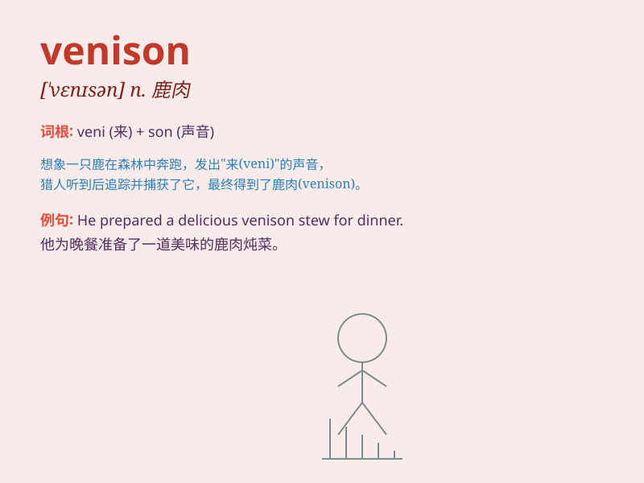

## venison

**英音:** _[\'venɪs(ə)n; \'venɪz(ə)n]_ **美音:**
_[\'vɛnəsn]_

**译义:** *n.野味,鹿肉*

### 短语

+ **venison steak:** _鹿肉排_

+ **roast venison:** _烤鹿肉_

+ **venison sausages:** _鹿肉香肠_

+ **grilled venison:** _烤炙的鹿肉_

+ **venison burger:** _鹿肉汉堡_

### 例句

#### 例句1

> **The restaurant serves delicious venison steaks.**

**中文翻译:** 这家餐厅供应美味的鹿肉牛排。

**单词释义:** 鹿肉

#### 例句2

> **We had venison for dinner last night.**

**中文翻译:** 昨晚我们晚餐吃了鹿肉。

**单词释义:** 鹿肉

#### 例句3

> **Hunting for venison is illegal in some areas.**

**中文翻译:** 在某些地区猎取鹿肉是违法的。

**单词释义:** 鹿肉

### 背诵小故事

> A hungry hunter went deep into the forest. After a long hunt, he
finally got a deer and had venison for dinner. He was so happy as it was
a delicious and rare treat.

**一个饥饿的猎人深入森林。经过漫长的狩猎，他终于捕获了一只鹿，晚餐有了鹿肉吃。他非常高兴，因为这是一顿美味又难得的大餐。**

### 图义

