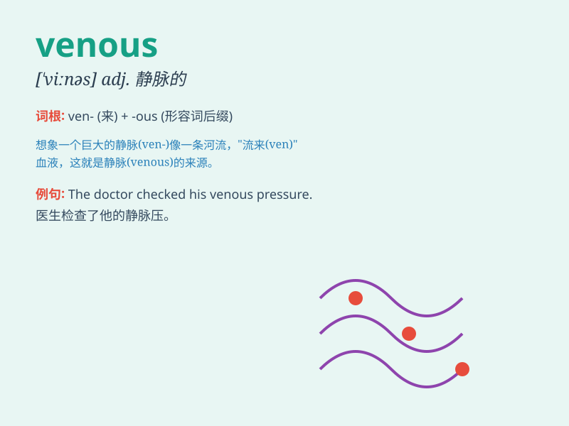

## venous

**英音:** _[\'viːnəs]_ **美音:** _[\'vinəs]_

**译义:** *adj.静脉的*

### 短语

+ **venous blood:** _静脉血_

+ **venous thrombosis:** _静脉血栓形成_

+ **venous system:** _静脉系统_

+ **venous return:** _静脉回流_

+ **venous drainage:** _静脉引流_

### 例句

#### 例句1

> **The doctor examined the patient\'s venous system.**

**中文翻译:** 医生检查了病人的静脉系统。

**单词释义:** 静脉的

#### 例句2

> **Venous blood flows back to the heart.**

**中文翻译:** 静脉血回流到心脏。

**单词释义:** 静脉的

#### 例句3

> **She has a problem with her venous circulation.**

**中文翻译:** 她的静脉循环有问题。

**单词释义:** 静脉的

### 背诵小故事

>
想象一下，有个勇敢的探险家在森林里迷路了，他受伤后发现自己的血管（venous）像蓝色的小路一样清晰可见。这些血管就像地图上的路线，引导着血液流动。

**想象一位迷路受伤的探险家看到清晰的血管，以此辅助记忆venous（静脉的；静脉血的）这个单词。**

### 图义

