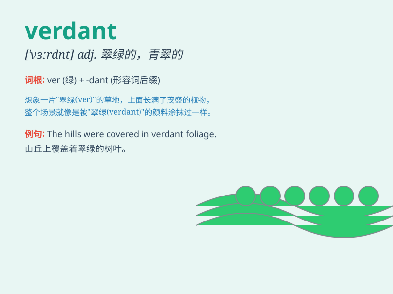

## verdant

**英音:** _[\'vɜːd(ə)nt]_ **美音:** _[\'vɝdnt]_

**译义:** *adj.翠绿的,青翠的,生疏的,没有经验的*

### 短语

+ **verdant grassland:** _翠绿的草原_

+ **verdant forest:** _葱郁的森林_

+ **verdant landscape:** _青翠的风景_

+ **verdant meadow:** _碧绿的草地_

+ **verdant hillside:** _青葱的山坡_

### 例句

#### 例句1

> **The countryside was filled with verdant meadows and lush
forests.**

**中文翻译:** 乡村到处是翠绿的草地和茂密的森林。

**单词释义:** 翠绿的

#### 例句2

> **The park is known for its verdant lawns and colorful flower
beds.**

**中文翻译:** 这个公园因其翠绿的草坪和五颜六色的花坛而闻名。

**单词释义:** 翠绿的

#### 例句3

> **The hillside was covered in verdant vegetation.**

**中文翻译:** 山坡上覆盖着郁郁葱葱的植被。

**单词释义:** 郁郁葱葱的

### 背诵小故事

> A little boy named Tom was lost in a forest. The forest was verdant,
filled with lush green grass and tall trees. Tom felt so peaceful and
enjoyed the beautiful green scene. Finally, he found his way home,
remembering the verdant landscape.

**一个叫汤姆的小男孩在森林里迷路了。这片森林郁郁葱葱，到处是茂盛的绿草和高大的树木。汤姆感到非常平静，享受着这美丽的绿色景色。最后，他找到了回家的路，记住了这片葱郁的景象。**

### 图义

