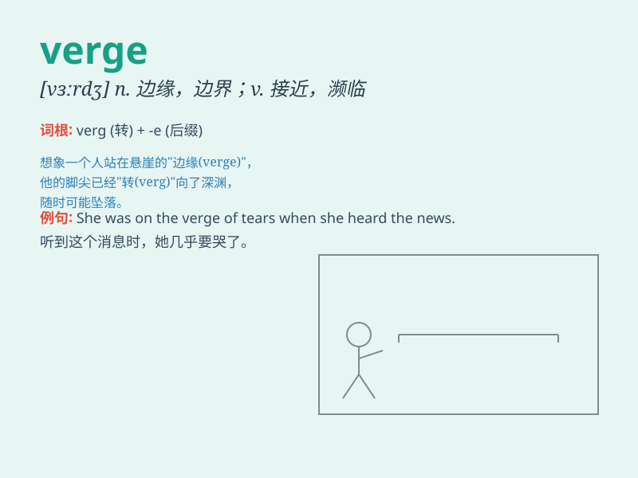

## verge

**英音:** _[vɜːdʒ]_ **美音:** _[vɝdʒ]_

**译义:** *v.濒临n.边缘*

### 短语

+ **verge on:** _近乎；接近_

+ **on the verge of:** _即将；接近于_

+ **verge road:** _路边；路旁_

+ **verge grass:** _路边草_

+ **verge to:** _倾向于；趋向_

### 例句

#### 例句1

> **The company is on the verge of bankruptcy.**

**中文翻译:** 这家公司濒临破产。

**单词释义:** 处于\...\...的边缘

#### 例句2

> **She was verging on tears when she heard the news.**

**中文翻译:** 她听到这个消息时几乎要哭了。

**单词释义:** 接近，近乎

#### 例句3

> **The road verges here are very narrow.**

**中文翻译:** 这里道路的边缘非常狭窄。

**单词释义:** 边缘，边界

### 背诵小故事

>
想象一下，你走在一条长长的路上，路的边缘（verge）长满了野花。当你靠近边缘时，仿佛就要迈出那关键的一步。verge
就像这路的边界，是即将到达某种状态的地方。

**想象你走在路上，路边长满野花，靠近路的边缘仿佛要迈出关键一步，verge
就像路的边界，是即将到达某种状态之处。**

### 图义

