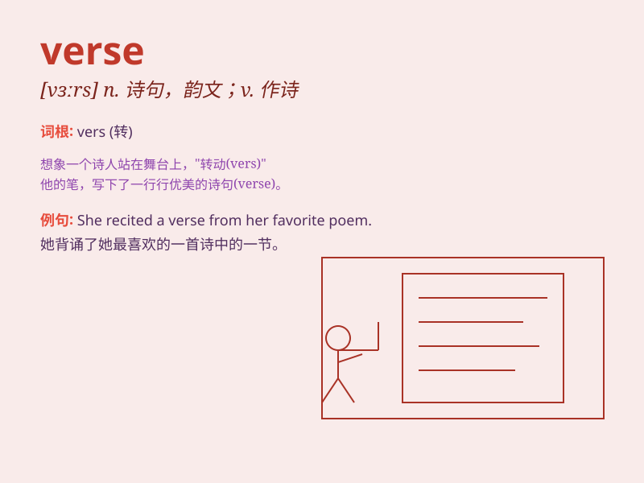

## verse

**英音:** _[vɜːs]_ **美音:** _[vɝs]_

**译义:** *n.韵文,诗,诗节,诗句,诗篇*

### 短语

+ **blank verse:** _无韵诗；素体诗_

+ **free verse:** _自由诗_

+ **narrative verse:** _叙事诗_

+ **lyric verse:** _抒情诗_

+ **satirical verse:** _讽刺诗_

### 例句

#### 例句1

> **He recited a verse from the Bible.**

**中文翻译:** 他背诵了《圣经》中的一节经文。

**单词释义:** 诗；韵文；诗句

#### 例句2

> **The song has a catchy verse.**

**中文翻译:** 这首歌有一段朗朗上口的主歌。

**单词释义:** （歌曲的）主歌

#### 例句3

> **She composed a beautiful verse for the occasion.**

**中文翻译:** 她为这个场合创作了一首优美的诗。

**单词释义:** 诗；诗歌

### 背诵小故事

> 一个诗人在幽静的森林中漫步，灵感突发，口中吟诵出美妙的 verse
。这些诗句如同闪烁的星星，照亮了他的心灵之路，也让周围的动物沉醉其中。

**一个诗人在森林中吟诵出美妙的诗句，这些诗句让人沉醉。**

### 图义

