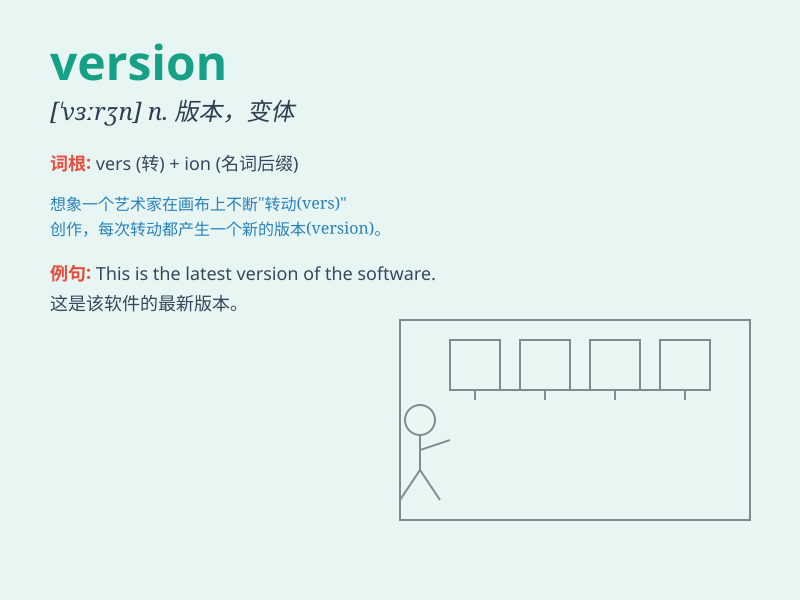

## version

**英音:** _[\'vɜːʃ(ə)n]_ **美音:** _[\'vɝʒn]_

**译义:** *n.译文,译本,翻译*

### 短语

+ **latest version:** _最新版本_

+ **previous version:** _以前的版本_

+ **software version:** _软件版本_

+ **version control:** _版本控制_

+ **trial version:** _试用版_

### 例句

#### 例句1

> **This is the latest version of the software.**

**中文翻译:** 这是这个软件的最新版本。

**单词释义:** 版本

#### 例句2

> **The director\'s version of the movie is quite different.**

**中文翻译:** 导演的这个电影版本相当不同。

**单词释义:** 版本

#### 例句3

> **He gave me his version of the events.**

**中文翻译:** 他给了我他对这些事件的说法。

**单词释义:** 说法；描述

### 背诵小故事

>
想象一下，一位作家在深夜努力创作，他不断修改自己的作品。每一次修改就是一个新的\'version\'（版本）。最终，他满意地完成了最完美的那个版本。

**想象一位作家创作并修改作品，每次修改就是一个版本，以此来记住 version
这个单词**

### 图义

