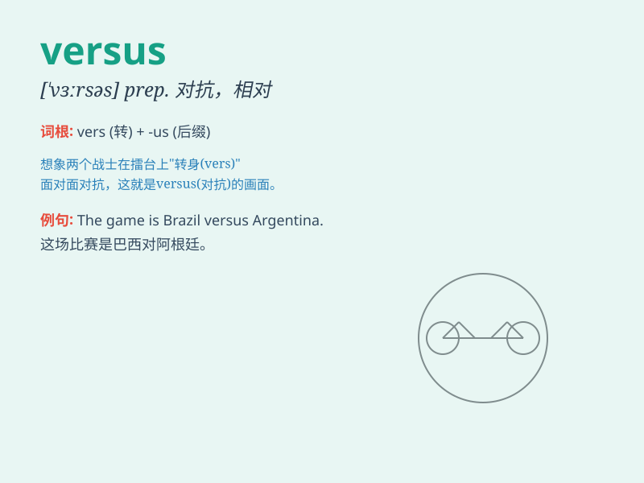

## versus

**英音:** _[\'vɜːsəs]_ **美音:** _[\'vɝsəs]_

**译义:** * prep.对(指诉讼,比赛等中),与\...相对*

### 短语

+ **versus prep.:** _对；与......相对_

+ **versus game:** _对抗赛_

+ **versus match:** _对垒比赛_

+ **versus system:** _对抗体系_

+ **versus challenge:** _对抗挑战_

### 例句

#### 例句1

> **The match is Brazil versus Argentina.**

**中文翻译:** 这场比赛是巴西对阵阿根廷。

**单词释义:** （表示两队或双方对阵）对，对抗

#### 例句2

> **The issue of privacy versus security is a complex one.**

**中文翻译:** 隐私与安全的问题是一个复杂的问题。

**单词释义:** （表示两个概念或事物的对比）与\...\...相对

#### 例句3

> **It\'s a debate of nature versus nurture.**

**中文翻译:** 这是一场先天与后天的辩论。

**单词释义:** （表示两种因素或力量的对比）与\...\...相比

### 背诵小故事

> In a fierce football match, Team A versus Team B. The players fought
hard on the field. \'Versus\' here shows the opposition and competition
between the two teams. It means \'against\' or \'in contrast to\'.

**在一场激烈的足球比赛中，A 队对阵 B
队。球员们在球场上奋力拼搏。"versus"在这里体现了两队之间的对立和竞争。它意为"对抗；与......相对"。**

### 图义

