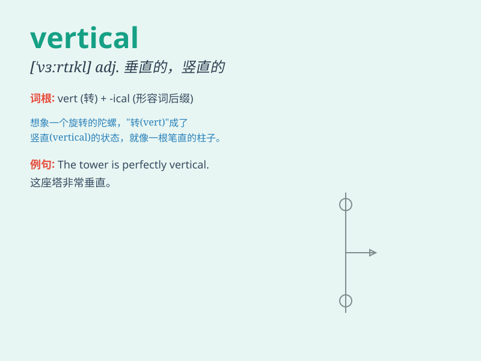

## vertical

**英音:** _[\'vɜːtɪk(ə)l]_ **美音:** _[\'vɝtɪkl]_

**译义:**
*adj.垂直的,直立的,顶点的,[解]头顶的n.垂直线,垂直面,竖向*

### 短语

+ **vertical line:** _垂直线_

+ **vertical integration:** _垂直整合；纵向结合_

+ **vertical position:** _垂直位置_

+ **vertical motion:** _垂直运动_

+ **vertical axis:** _纵轴；垂直轴_

### 例句

#### 例句1

> **The wall is perfectly vertical.**

**中文翻译:** 这面墙是完全垂直的。

**单词释义:** 垂直的

#### 例句2

> **The airplane climbed in a vertical ascent.**

**中文翻译:** 飞机垂直上升。

**单词释义:** 垂直的

#### 例句3

> **The vertical line on the graph shows a sudden increase.**

**中文翻译:** 图表上的垂直线显示出突然的增长。

**单词释义:** 垂直的；竖的

### 背诵小故事

> A brave climber was trying to reach the top of a vertical cliff. He
struggled but never gave up. Finally, he made it, showing that with
determination, one can overcome any vertical challenge.

**一位勇敢的登山者试图攀登垂直的悬崖顶部。他奋力挣扎但从未放弃。最终，他成功了，表明只要有决心，就能克服任何垂直的挑战。**

### 图义

