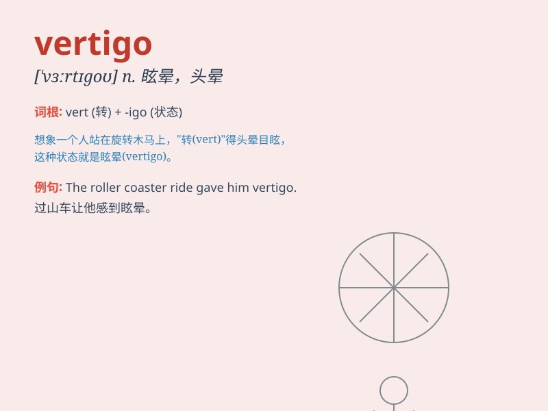

## vertigo

**英音:** _[\'vɜːtɪgəʊ]_ **美音:** _[\'vɝtɪɡo]_

**译义:** *n.眩晕,晕头转向*

### 短语

+ **positional vertigo:** _位置性眩晕_

+ **labyrinthine vertigo:** _迷路性眩晕_

+ **central vertigo:** _中枢性眩晕_

+ **peripheral vertigo:** _周围性眩晕_

+ **vertigo attack:** _眩晕发作_

### 例句

#### 例句1

> **I felt a sudden attack of vertigo when I looked down from the top
of the building.**

**中文翻译:** 当我从大楼顶部往下看时，突然感到一阵眩晕。

**单词释义:** 眩晕

#### 例句2

> **The patient was diagnosed with vertigo after experiencing
frequent dizziness.**

**中文翻译:** 这位患者在频繁感到头晕后被诊断出患有眩晕症。

**单词释义:** 眩晕症

#### 例句3

> **She had to hold onto something to steady herself as the vertigo
set in.**

**中文翻译:** 眩晕袭来时，她不得不抓住东西稳住自己。

**单词释义:** 眩晕

### 背诵小故事

> One day, a brave climber named Tom reached the top of a very high
mountain. But suddenly, he felt a strong sense of vertigo. He couldn\'t
look down without feeling dizzy and unsteady.

**有一天，一位勇敢的攀登者汤姆到达了一座非常高的山的山顶。但突然，他感到一阵强烈的眩晕。他只要往下看就会感到头晕目眩、站立不稳。**

### 图义

