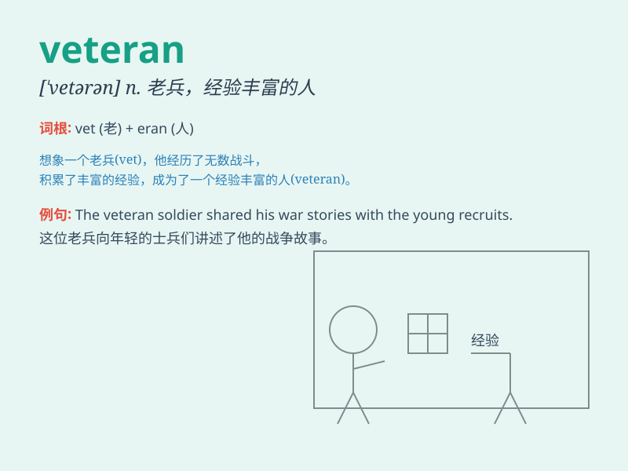

## veteran

**英音:** _[\'vet(ə)r(ə)n]_ **美音:** _[\'vɛtərən]_

**译义:** *n.老兵,老手,富有经验的人,退伍军人adj.老兵的,经验丰富的*

### 短语

+ **veteran player:** _资深运动员；经验丰富的选手_

+ **veteran car:** _老式汽车；老旧车辆_

+ **veteran worker:** _老工人；资深员工_

+ **veteran soldier:** _老兵；退伍军人_

+ **veteran performer:** _资深表演者；经验丰富的演员_

### 例句

#### 例句1

> **The veteran soldier shared his war experiences with the young
recruits.**

**中文翻译:** 这位老兵与新兵分享了他的战争经历。

**单词释义:** 经验丰富的军人

#### 例句2

> **She is a veteran actress with many awards to her name.**

**中文翻译:** 她是一位屡获殊荣的资深女演员。

**单词释义:** 经验丰富的

#### 例句3

> **The veteran teacher has a unique way of teaching.**

**中文翻译:** 这位资深教师有一种独特的教学方式。

**单词释义:** 资深的

### 背诵小故事

> A veteran soldier once told me about his many battles. He was brave
and experienced. His tales showed that a veteran has gone through a lot
and has the wisdom and skills. Remember, veteran means someone with long
experience and expertise.

**一位老兵曾经给我讲述他经历的众多战役。他勇敢且经验丰富。他的故事表明老兵经历丰富，拥有智慧和技能。记住，veteran
意思是经验丰富的人。**

### 图义

