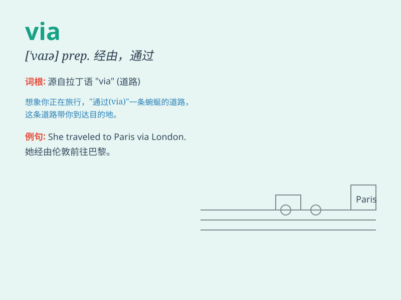

## via

**英音:** _[ˈvaɪə，ˈviːə]_ **美音:** _[ˈvaɪə, ˈviə]_

**译义:** * prep.经,通过,经由*

### 短语

+ **via media:** _中间道路；中庸之道_

+ **via dolorosa:** _苦路（耶稣前往受难地所经之路）_

+ **via satellite:** _通过卫星_

+ **travel via:** _经由......旅行_

+ **send via:** _通过......发送_

### 例句

#### 例句1

> **I sent the package via express delivery.**

**中文翻译:** 我通过快递寄送了这个包裹。

**单词释义:** 通过

#### 例句2

> **We traveled to Italy via France.**

**中文翻译:** 我们经由法国去了意大利。

**单词释义:** 经由

#### 例句3

> **The news spread via social media.**

**中文翻译:** 这则新闻通过社交媒体传播开来。

**单词释义:** 通过

### 背诵小故事

> A little bird was flying via a beautiful forest to reach its home. It
passed through many trees and saw lovely flowers along the way. \'Via\'
here shows the path or route the bird took.

**一只小鸟正经由一片美丽的森林飞回家。它穿过了许多树木，沿途看到了可爱的花朵。这里的\'via\'表示小鸟所走的路径或路线。**

### 图义

