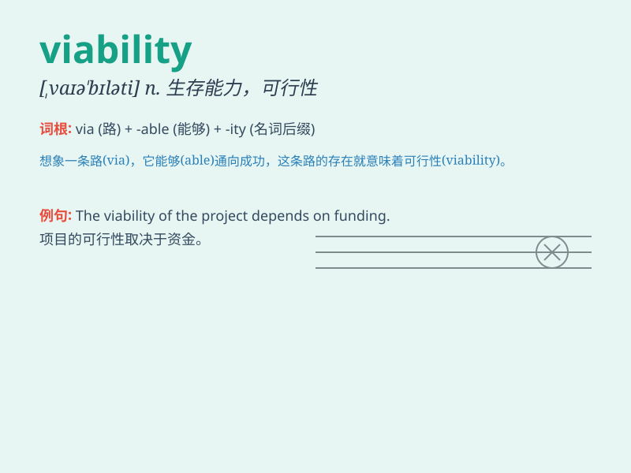

## viability

**英音:** _[,vaɪə\'bɪlətɪ]_ **美音:** _[,vaɪə\'bɪləti]_

**译义:** *n.生存能力,发育能力*

### 短语

+ **economic viability:** _经济可行性_

+ **viability assessment:** _生存能力评估_

+ **commercial viability:** _商业可行性_

+ **project viability:** _项目可行性_

+ **viability study:** _可行性研究_

### 例句

#### 例句1

> **The viability of the new business model is still in question.**

**中文翻译:** 新商业模式的可行性仍然存在疑问。

**单词释义:** 可行性；生存能力

#### 例句2

> **We need to assess the viability of this project before investing
more resources.**

**中文翻译:** 在投入更多资源之前，我们需要评估这个项目的可行性。

**单词释义:** 可行性

#### 例句3

> **The viability of the ecosystem depends on the balance of various
factors.**

**中文翻译:** 生态系统的生存能力取决于各种因素的平衡。

**单词释义:** 生存能力

### 背诵小故事

> A scientist was working hard to prove the viability of a new energy
source. After many experiments and setbacks, success came. The new
source was viable, meaning it was capable of working effectively and had
a practical chance of success.

**一位科学家努力工作以证明一种新能源的可行性。经过多次实验和挫折，成功到来了。这种新能源是可行的，意味着它能够有效地运作并且有实际成功的机会。**

### 图义

