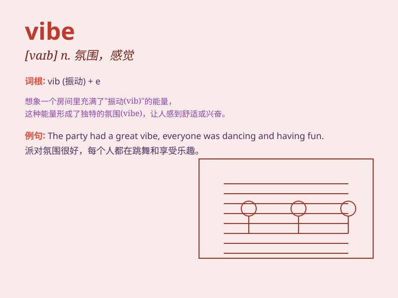

## vibe

**英音:** _[vaɪb]_ **美音:** _[vaɪb]_

**译义:** *n. 氛围，气氛；共鸣；（音乐的）颤动；（感情的）共鸣 vi.
产生共鸣；（音乐）产生颤动*

### 短语

+ **good vibe:** _良好的氛围或感觉_

+ **bad vibe:** _不好的氛围或感觉_

+ **vibe check:** _氛围或感觉的检查_

+ **positive vibe:** _积极的氛围_

+ **negative vibe:** _消极的氛围_

### 例句

#### 例句1

> **The party had a great vibe.**

**中文翻译:** 这个派对氛围很棒。

**单词释义:** 氛围；气氛

#### 例句2

> **I got a bad vibe from that guy.**

**中文翻译:** 我从那个人身上感觉到一种不好的氛围。

**单词释义:** （给人的）感觉；印象

#### 例句3

> **The music gave the room a relaxing vibe.**

**中文翻译:** 音乐让这个房间有一种令人放松的氛围。

**单词释义:** 氛围；气氛

### 背诵小故事

> One day, I was in a coffee shop. The music and the warm atmosphere
gave me a special feeling. That\'s the \'vibe\' I want to remember.
It\'s like a magic mood that makes you feel good.

**有一天，我在一家咖啡店。音乐和温暖的氛围给了我一种特别的感觉。那就是我想要记住的"氛围、气氛"。它就像一种神奇的心情，让你感觉良好。**

### 图义

