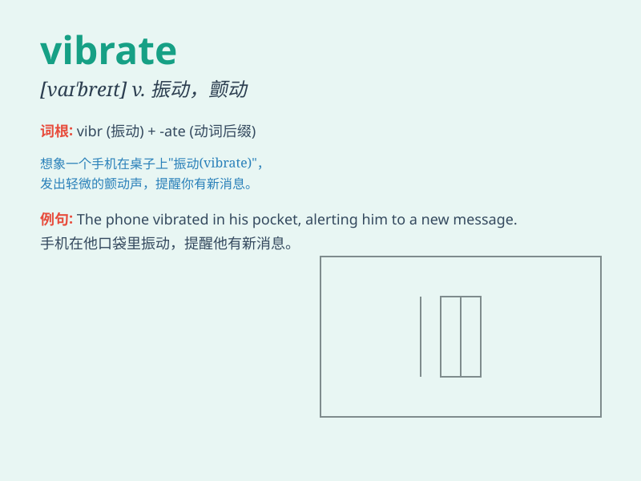

## vibrate

**英音:** _[vaɪ\'breɪt]_ **美音:** _[vaɪ\'breɪt]_

**译义:** *v.(使)振动,(使)摇摆*

### 短语

+ **vibrate with:** _因\...而振动；充满（某种情感）_

+ **vibrate constantly:** _持续振动_

+ **vibrate rapidly:** _快速振动_

+ **vibrate slightly:** _轻微振动_

+ **vibrate intensely:** _强烈振动_

### 例句

#### 例句1

> **The phone vibrated on the table.**

**中文翻译:** 手机在桌子上震动。

**单词释义:** 震动

#### 例句2

> **The strings of the guitar vibrate when you pluck them.**

**中文翻译:** 当你拨弄吉他弦时，它们会振动。

**单词释义:** 振动

#### 例句3

> **The engine vibrated loudly as it struggled to start.**

**中文翻译:** 发动机在艰难启动时发出很大的震动声。

**单词释义:** （发出）震动（声）

### 背诵小故事

> A bee was trapped in a small box. It kept trying to escape and its
wings vibrated rapidly, making a buzzing sound. The rapid movement of
its wings is like the meaning of \'vibrate\'.

**一只蜜蜂被困在一个小盒子里。它不停地试图逃跑，翅膀快速振动，发出嗡嗡声。它翅膀的快速移动就像\'vibrate\'这个词的意思。**

### 图义

