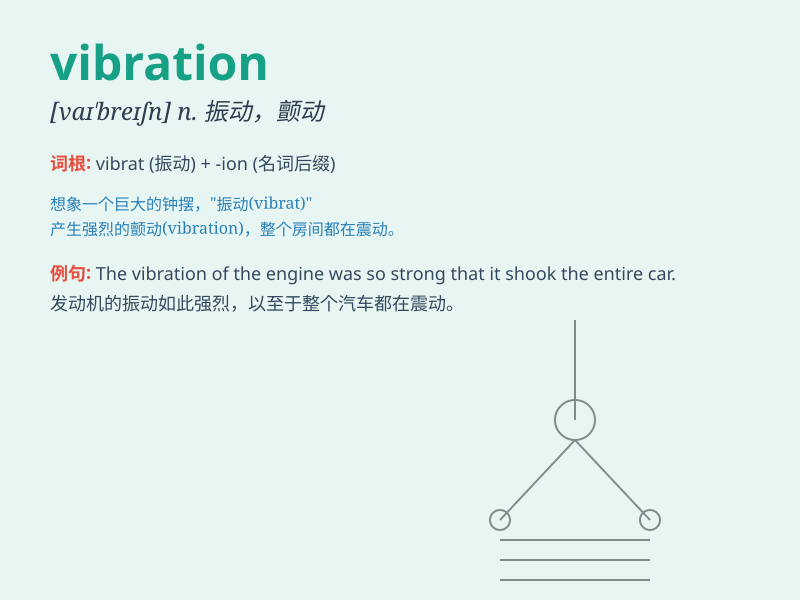

## vibration

**英音:** _[vaɪ\'breɪʃ(ə)n]_ **美音:** _[vaɪ\'breʃən]_

**译义:** *n.振动,颤动,摇动,摆动*

### 短语

+ **vibration frequency:** _振动频率_

+ **vibration mode:** _振动模式_

+ **vibration isolation:** _隔振；振动隔离_

+ **vibration sensor:** _振动传感器_

+ **mechanical vibration:** _机械振动_

### 例句

#### 例句1

> **The vibration of the engine could be felt through the seat.**

**中文翻译:** 发动机的震动可以通过座位感觉到。

**单词释义:** 震动

#### 例句2

> **The phone\'s vibration mode alerted him to the incoming call.**

**中文翻译:** 手机的震动模式提醒他有来电。

**单词释义:** 震动

#### 例句3

> **There was a slight vibration in the floor when the heavy truck
passed by.**

**中文翻译:** 当重型卡车经过时，地板有轻微的震动。

**单词释义:** 震动

### 背诵小故事

> A bee was trapped in a small box. It kept hitting the walls, causing
strong vibrations. The vibrations were like a signal for help. Finally,
someone heard and opened the box to set the bee free.

**一只蜜蜂被困在一个小盒子里。它不停地撞击墙壁，产生强烈的振动。这些振动就像是求救的信号。最后，有人听到并打开盒子将蜜蜂放走了。**

### 图义

