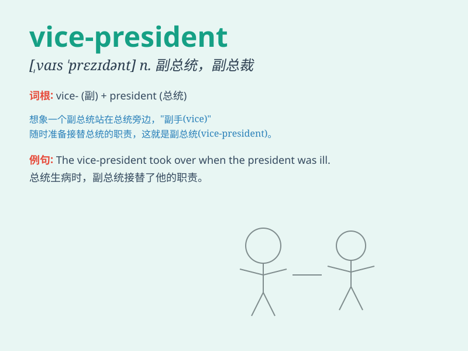

## vice-president

**英音:** _[vaɪs-ˈprezɪdənt]_ **美音:**
_[vaɪs-ˈprezɪdənt]_

**译义:**
*n.副总统，副校长，副董事长等；adj.副总统的，副校长的，副董事长的等*

### 短语

+ **vice-president elect:** _当选副总统_

+ **vice-president designate:** _指定的副总统_

+ **former vice-president:** _前副总统_

+ **acting vice-president:** _代理副总统_

+ **vice-president candidate:** _副总统候选人_

### 例句

#### 例句1

> **The vice-president attended the meeting on behalf of the
president.**

**中文翻译:** 副总统代表总统出席了会议。

**单词释义:** 副总统

#### 例句2

> **She was promoted to vice-president of the company last year.**

**中文翻译:** 她去年被提升为公司的副总裁。

**单词释义:** 副总裁

#### 例句3

> **The vice-president is responsible for supervising several
departments.**

**中文翻译:** 副总裁负责监督几个部门。

**单词释义:** 副总裁

### 背诵小故事

> 想象一个公司，总裁不在时，vice-president
就挑起大梁。有一次重要会议，总裁出差，vice-president
勇敢站出，成功解决难题，让大家知道了副总统/副总裁的重要性。

**想象一家公司，总裁不在时，副总统/副总裁挑起大梁。在一次重要会议上，总裁出差，副总统/副总裁勇敢站出来，成功解决难题，让大家明白了副总统/副总裁的重要性。**

### 图义

