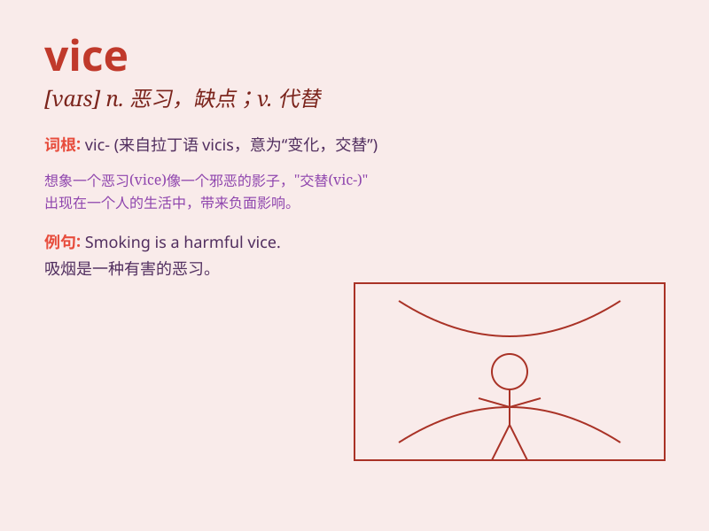

## vice

**英音:** _[vaɪs]_ **美音:** _[vaɪs]_

**译义:** *n.恶习,恶行,坏脾气,罪恶,堕落,老虎钳,缺点,缺陷vt.钳住
prep.代替*

### 短语

+ **vice versa:** _反之亦然_

+ **vice president:** _副总统；副总裁_

+ **vice grip:** _老虎钳；大力钳_

+ **vice squad:** _刑警队；警察缉捕队_

+ **vice chancellor:** _（英国大学的）副校长_

### 例句

#### 例句1

> **He was dismissed from his job due to his vice of gambling.**

**中文翻译:** 他因赌博的恶习而被解雇了。

**单词释义:** 恶习；缺点

#### 例句2

> **The vice president attended the meeting on behalf of the
president.**

**中文翻译:** 副总统代表总统出席了会议。

**单词释义:** 副的；副职

#### 例句3

> **The machine was held in place by a vice.**

**中文翻译:** 这台机器用虎钳固定住了。

**单词释义:** 虎钳；台钳

### 背诵小故事

> A thief was caught by the police. His vice was stealing. But after
being punished, he decided to change and give up this bad habit. Vice
means immoral or bad behavior.

**一个小偷被警察抓住了。他的恶习是偷窃。但在受到惩罚后，他决定改变并放弃这个坏习惯。Vice
意思是不道德的或不良的行为。**

### 图义

