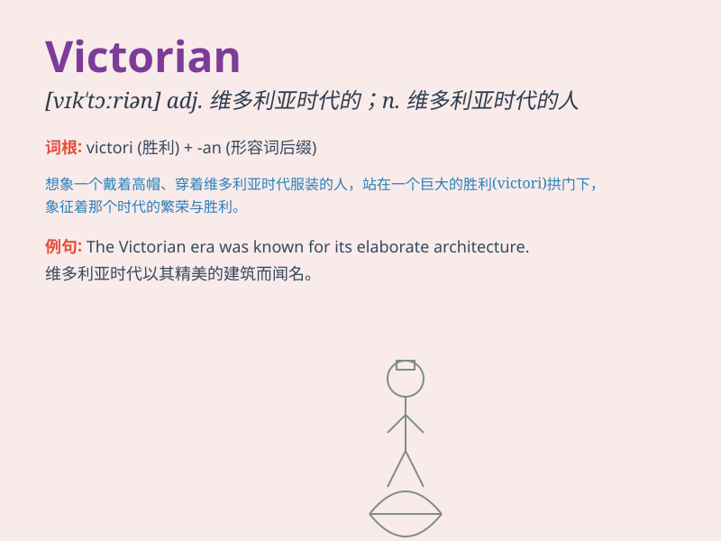

## Victorian

**英音:** _[vɪkˈtɔːriən]_ **美音:** _[vɪkˈtɔːriən]_

**译义:**
*adj.维多利亚女王时代的;维多利亚式的n.维多利亚女王时代的人*

### 短语

+ **Victorian era:** _维多利亚时代_

+ **Victorian architecture:** _维多利亚式建筑_

+ **Victorian literature:** _维多利亚文学_

+ **Victorian values:** _维多利亚价值观_

+ **Victorian style:** _维多利亚风格_

### 例句

#### 例句1

> **The house has a typical Victorian style.**

**中文翻译:** 这座房子具有典型的维多利亚风格。

**单词释义:** 维多利亚式的；维多利亚时期的

#### 例句2

> **She collects Victorian furniture.**

**中文翻译:** 她收藏维多利亚时期的家具。

**单词释义:** 维多利亚时期的

#### 例句3

> **The Victorian era was known for its strict social norms.**

**中文翻译:** 维多利亚时代以其严格的社会规范而闻名。

**单词释义:** 维多利亚时期的

### 背诵小故事

> In a Victorian town, a young girl wore beautiful clothes with
elaborate lace. The houses had ornate designs. It was a time of elegance
and strict rules. People were polite and proper. Remember, Victorian
means related to the period of Queen Victoria.

**在一个维多利亚时代的小镇上，一个年轻女孩穿着带有精美蕾丝的漂亮衣服。房屋有着华丽的设计。那是一个优雅且规则严格的时代。人们彬彬有礼、举止得体。记住，Victorian
意思是与维多利亚女王时期有关的。**

### 图义

