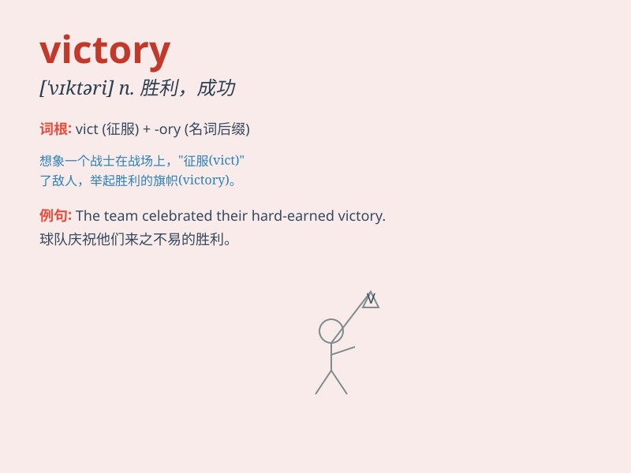

## victory

**英音:** _[\'vɪkt(ə)rɪ]_ **美音:** _[\'vɪktəri]_

**译义:** *n.胜利,战胜,克服,[罗神]胜利女神*

### 短语

+ **final victory:** _最终的胜利_

+ **narrow victory:** _险胜_

+ **landslide victory:** _压倒性胜利_

+ **moral victory:** _精神胜利_

+ **claim victory:** _宣告胜利_

### 例句

#### 例句1

> **The team celebrated their victory with great joy.**

**中文翻译:** 这个团队非常高兴地庆祝他们的胜利。

**单词释义:** 胜利

#### 例句2

> **Her hard work led to a sweet victory in the competition.**

**中文翻译:** 她的努力工作使她在比赛中获得了甜蜜的胜利。

**单词释义:** 胜利

#### 例句3

> **The victory was a result of teamwork and determination.**

**中文翻译:** 这次胜利是团队合作和决心的结果。

**单词释义:** 胜利

### 背诵小故事

> A brave warrior led his army into a fierce battle. Despite many
difficulties, they never gave up. In the end, they achieved a great
victory and everyone cheered. The warrior knew that victory comes with
determination and courage.

**一位勇敢的战士率领他的军队投入一场激烈的战斗。尽管困难重重，他们从未放弃。最终，他们取得了巨大的胜利，每个人都欢呼起来。战士明白胜利源于决心和勇气。**

### 图义

