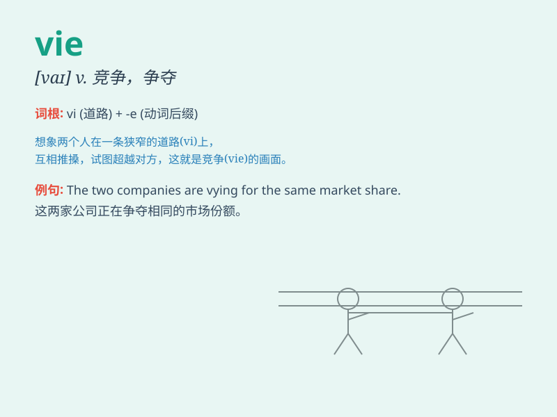

## vie

**英音:** _[vaɪ]_ **美音:** _[vaɪ]_

**译义:** *vi.竞争,争夺;vt.争取,力求获得*

### 短语

+ **vie for:** _竞争；争夺_

+ **vie with:** _与\...\...竞争；与\...\...抗衡_

+ **vie to do sth:** _争相做某事_

+ **vie in sth:** _在某方面竞争_

+ **vie among:** _在\...\...之中竞争_

### 例句

#### 例句1

> **The two companies are vying for the contract.**

**中文翻译:** 这两家公司正在争夺合同。

**单词释义:** 竞争；争夺

#### 例句2

> **Candidates vied with each other to win the position.**

**中文翻译:** 候选人们相互竞争以赢得这个职位。

**单词释义:** 竞争；争抢

#### 例句3

> **The teams vied in the championship game.**

**中文翻译:** 这些队伍在冠军赛中竞争。

**单词释义:** 竞争；较量

### 背诵小故事

> In a magical forest, fairies vie to be the most beautiful. They show
off their shiny wings and charming smiles. The competition is fierce,
but they all enjoy the vie for beauty.

**在一个神奇的森林里，仙女们竞相成为最美丽的。她们展示着闪亮的翅膀和迷人的微笑。竞争很激烈，但她们都享受着这种争美的过程。**

### 图义

