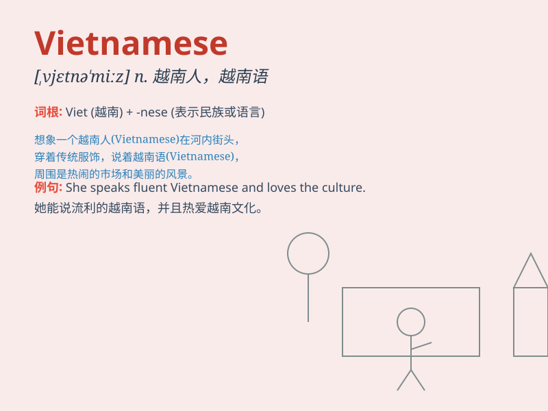

## Vietnamese

**英音:** _[ˌvjet.nə.mɛs]_ **美音:** _[ˌviɛt.nə.mɪs]_

**译义:** *越南的；越南人的；越南语的*

### 短语

+ **Vietnamese cuisine:** _越南美食_

+ **Vietnamese language:** _越南语_

+ **Vietnamese people:** _越南人_

+ **Vietnamese culture:** _越南文化_

+ **Vietnamese coffee:** _越南咖啡_

### 例句

#### 例句1

> **The Vietnamese cuisine is known for its rich flavors.**

**中文翻译:** 越南菜以其丰富的口味而闻名。

**单词释义:** 越南的；越南人的；越南语的

#### 例句2

> **She is learning Vietnamese to communicate with her business
partners.**

**中文翻译:** 她正在学习越南语以便与她的商业伙伴交流。

**单词释义:** 越南语

#### 例句3

> **Many Vietnamese people enjoy traditional music and dance.**

**中文翻译:** 许多越南人喜欢传统的音乐和舞蹈。

**单词释义:** 越南的；越南人的

### 背诵小故事

>
想象一下，你去越南旅行，遇到了友好的当地人，他们热情地跟你交流。你发现他们被称为
Vietnamese ，这个词就代表了越南的、越南人的、越南语的意思。

**想象你在越南旅行，遇到当地人，从而记住 Vietnamese
代表越南的、越南人的、越南语的**

### 图义

