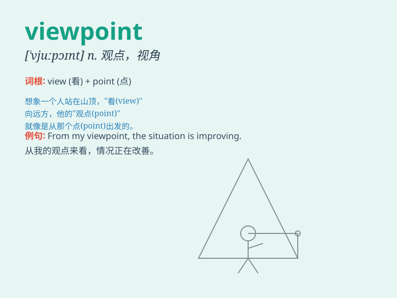

## viewpoint

**英音:** _[\'vjuːpɒɪnt]_ **美音:** _[\'vjupɔɪnt]_

**译义:** *n.观点*

### 短语

+ **different viewpoints:** _不同的观点_

+ **broaden one\'s viewpoint:** _拓宽某人的观点_

+ **share the same viewpoint:** _持有相同的观点_

+ **from a historical viewpoint:** _从历史的观点来看_

+ **change one\'s viewpoint:** _改变某人的观点_

### 例句

#### 例句1

> **From my viewpoint, this plan is not feasible.**

**中文翻译:** 在我看来，这个计划不可行。

**单词释义:** 观点；看法

#### 例句2

> **His viewpoint on marriage is quite traditional.**

**中文翻译:** 他对婚姻的观点相当传统。

**单词释义:** 观点；见解

#### 例句3

> **We need to consider the problem from different viewpoints.**

**中文翻译:** 我们需要从不同的观点来考虑这个问题。

**单词释义:** 观点；视角

### 背诵小故事

> One day, while hiking on a mountain, Tom stopped at a peak. From that
high viewpoint, he could see the vast landscape and beautiful scenery.
It was a moment he would never forget.

**有一天，汤姆在爬山时，在山顶停了下来。从那个高处的观点位置，他能够看到广阔的地貌和美丽的风景。那是他永远不会忘记的一刻。**

### 图义

