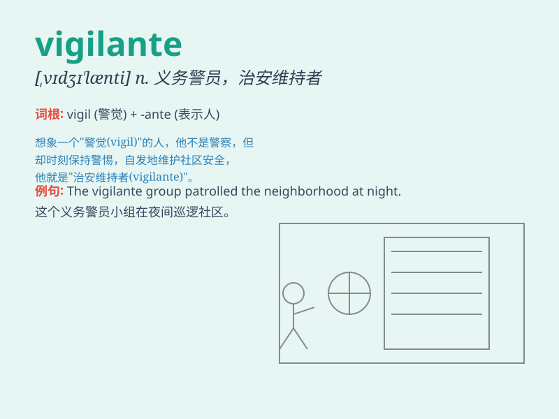

## vigilante

**英音:** _[,vɪdʒɪ\'læntɪ]_ **美音:** _[\'vɪdʒə\'lænti]_

**译义:** *n.义务警员*

### 短语

+ **vigilante justice:** _私刑正义_

+ **vigilante group:** _治安维持团体_

+ **vigilante action:** _自发的执法行动_

+ **vigilante patrol:** _治安巡逻_

+ **vigilante mentality:** _治安维持心态_

### 例句

#### 例句1

> **The vigilante took matters into his own hands when the police
were slow to act.**

**中文翻译:** 当警察行动迟缓时，这位义务警员自己动手处理事情。

**单词释义:** 义务警员

#### 例句2

> **Some people see the vigilante as a hero, while others view them
as a lawbreaker.**

**中文翻译:**
有些人认为这位义务警员是英雄，而另一些人则认为他们是违法者。

**单词释义:** 义务警员

#### 例句3

> **The vigilante group patrolled the neighborhood at night to
prevent crime.**

**中文翻译:** 这个义务警员团体在夜间巡逻社区以预防犯罪。

**单词释义:** 义务警员

### 背诵小故事

> One night, a thief broke into a house. But a mysterious figure, the
vigilante, appeared. He was always on the lookout for crimes and
protected the neighborhood. The vigilante caught the thief and brought
peace back.

**一天晚上，一个小偷闯入了一所房子。但出现了一个神秘人物，即治安维持者，他总是留意犯罪行为并保护着这片街区。这位治安维持者抓住了小偷，让这里恢复了平静。**

### 图义

