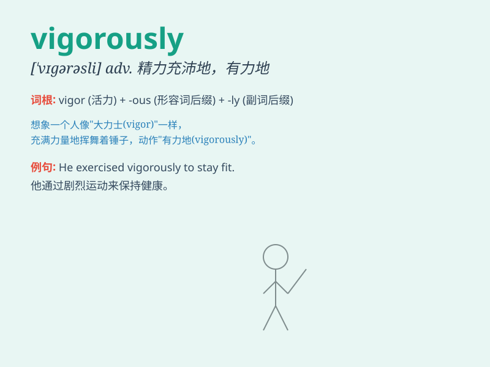

## vigorously

**英音:** _[\'vɪg(ə)rəslɪ]_ **美音:** _[\'vɪgərəsli]_

**译义:** *adv.精神旺盛地*

### 短语

+ **vigorously oppose:** _强烈反对_

+ **vigorously defend:** _大力捍卫_

+ **vigorously protest:** _强烈抗议_

+ **vigorously promote:** _大力推动_

+ **vigorously pursue:** _积极追求_

### 例句

#### 例句1

> **He was vigorously defending his position during the debate.**

**中文翻译:** 在辩论中，他极力捍卫自己的立场。

**单词释义:** 强有力地；精力充沛地

#### 例句2

> **The athlete trained vigorously to prepare for the
competition.**

**中文翻译:** 这位运动员为准备比赛而刻苦训练。

**单词释义:** 用力地；积极地

#### 例句3

> **She shook her head vigorously to show her disagreement.**

**中文翻译:** 她用力摇头表示不同意。

**单词释义:** 剧烈地；猛烈地

### 背诵小故事

> A little rabbit was running vigorously in the forest to escape from a
hungry wolf. It used all its strength and moved quickly. Finally, it
found a safe cave and survived.

**一只小兔子在森林里奋力地跑以躲避一只饥饿的狼。它用尽全身力气，快速移动。最终，它找到了一个安全的洞穴并活了下来。**

### 图义

