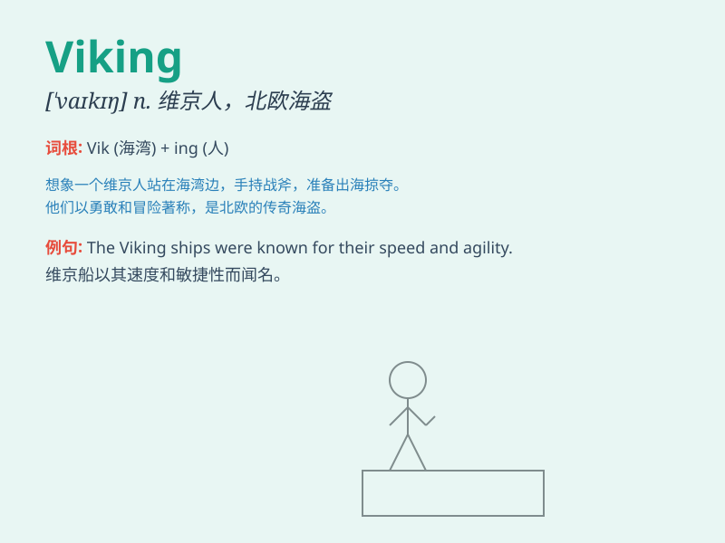

## Viking

**英音:** _[ˈvaɪkɪŋ]_ **美音:** _[ˈvaɪkɪŋ]_

**译义:** *n. 维京人；北欧海盗 adj. 维京人的；北欧海盗的*

### 短语

+ **Viking Age:** _维京时代_

+ **Viking raid:** _维京人的袭击_

+ **Viking ship:** _维京船_

+ **Viking settlement:** _维京人的定居点_

+ **Viking warrior:** _维京战士_

### 例句

#### 例句1

> **The Vikings were known for their seafaring skills.**

**中文翻译:** 维京人以他们的航海技能而闻名。

**单词释义:** 维京人

#### 例句2

> **The museum has an exhibition about the Vikings.**

**中文翻译:** 这个博物馆有一个关于维京人的展览。

**单词释义:** 维京人

#### 例句3

> **The Viking raids caused much fear in Europe.**

**中文翻译:** 维京人的袭击在欧洲引起了很大的恐慌。

**单词释义:** 维京人

### 背诵小故事

> Long ago, a brave group of seafarers known as Vikings set out on
adventures. They were fierce warriors with strong ships. They raided and
explored faraway lands. Remember, these were the Vikings!

**很久以前，有一群勇敢的航海者被称为维京人，他们踏上了冒险之旅。他们是勇猛的战士，拥有坚固的船只。他们四处劫掠和探索遥远的土地。记住，这些就是维京人！**

### 图义

