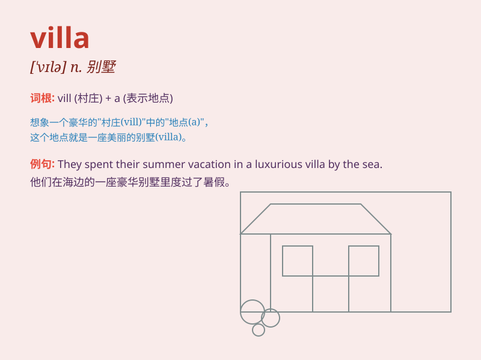

## villa

**英音:** _[\'vɪlə]_ **美音:** _[\'vɪlə]_

**译义:** *n.别墅,\<英>城郊小屋*

### 短语

+ **villa resort:** _别墅度假村_

+ **luxury villa:** _豪华别墅_

+ **seaside villa:** _海边别墅_

+ **mountain villa:** _山间别墅_

+ **villa rental:** _别墅出租_

### 例句

#### 例句1

> **She bought a beautiful villa by the sea.**

**中文翻译:** 她在海边买了一栋漂亮的别墅。

**单词释义:** 别墅

#### 例句2

> **The rich man has several villas in different countries.**

**中文翻译:** 这个有钱人在不同的国家有几栋别墅。

**单词释义:** 别墅

#### 例句3

> **We spent our vacation in a luxurious villa.**

**中文翻译:** 我们在一栋豪华的别墅里度假。

**单词释义:** 别墅

### 背诵小故事

> A rich man was tired of city life. So he bought a beautiful villa by
the sea. There were colorful flowers and a big swimming pool. He enjoyed
his peaceful time there.

**一个富人厌倦了城市生活。于是他在海边买了一栋漂亮的别墅。那里有五颜六色的花和一个大游泳池。他在那里享受着宁静的时光。**

### 图义

