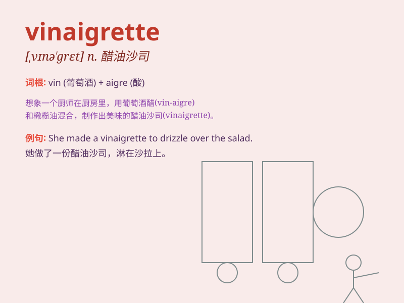

## vinaigrette

**英音:** _[,vɪnɪ\'gret; ,vɪneɪ-]_ **美音:**
_[,vɪnɪ\'ɡrɛt]_

**译义:** *n.香料饰盒,香料嗅瓶*

### 短语

+ **lemon vinaigrette:** _柠檬醋汁_

+ **balsamic vinaigrette:** _香醋油醋汁_

+ **homemade vinaigrette:** _自制醋汁_

+ **vinaigrette dressing:** _醋汁调味料_

+ **herb vinaigrette:** _香草醋汁_

### 例句

#### 例句1

> **The chef prepared a delicious vinaigrette for the salad.**

**中文翻译:** 这位厨师为沙拉准备了美味的醋油沙司。

**单词释义:** 醋油沙司

#### 例句2

> **She drizzled the vinaigrette over the grilled vegetables.**

**中文翻译:** 她把醋油沙司淋在烤蔬菜上。

**单词释义:** 醋油沙司

#### 例句3

> **The vinaigrette added a tangy flavor to the dish.**

**中文翻译:** 醋油沙司为这道菜增添了浓郁的味道。

**单词释义:** 醋油沙司

### 背诵小故事

> A chef was making a special salad. He mixed vinegar and oil carefully
to create a delicious vinaigrette. The vinaigrette made the salad taste
amazing and everyone loved it.

**一位厨师正在制作一份特别的沙拉。他仔细地将醋和油混合，制成了美味的油醋汁。这种油醋汁让沙拉味道绝佳，每个人都喜欢。**

### 图义

