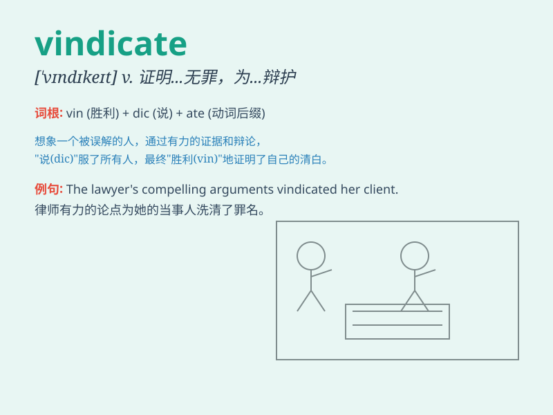

## vindicate

**英音:** _[\'vɪndɪkeɪt]_ **美音:** _[\'vɪndɪket]_

**译义:** *vt.维护,辩护,表白*

### 短语

+ **vindicate one\'s rights:** _维护某人的权利_

+ **vindicate oneself:** _为自己辩白_

+ **vindicate sb\'s honor:** _维护某人的名誉_

+ **vindicate the truth:** _证明真理_

+ **vindicate sb\'s claim:** _证实某人的主张_

### 例句

#### 例句1

> **His success in the project vindicated his innovative
approach.**

**中文翻译:** 他在这个项目中的成功证明了他创新方法的正确性。

**单词释义:** 证明\...\...正确；为\...\...平反

#### 例句2

> **The new evidence vindicated her claim.**

**中文翻译:** 新的证据证明了她的主张。

**单词释义:** 证明\...\...有道理；证实

#### 例句3

> **The investigation vindicated the company\'s reputation.**

**中文翻译:** 这次调查维护了公司的声誉。

**单词释义:** 维护；辩护

### 背诵小故事

> A detective was wrongly accused of a crime. But through his
persistent efforts and gathering of evidence, he finally vindicated
himself and proved his innocence.

**一位侦探被错误地指控犯罪。但通过他坚持不懈的努力和证据收集，他最终为自己洗清了罪名，证明了自己的清白。**

### 图义

