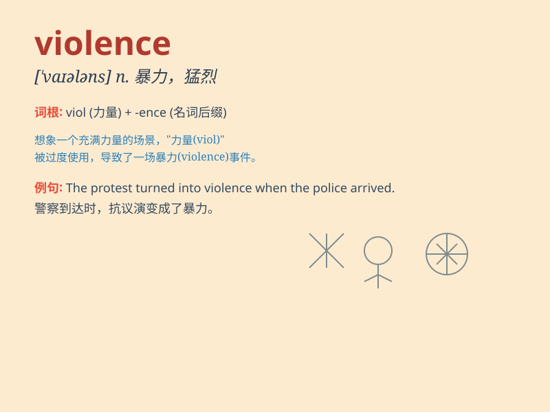

## violence

**英音:** _[\'vaɪəl(ə)ns]_ **美音:** _[\'vaɪələns]_

**译义:** *n.猛烈,强烈,暴力,暴虐,暴行,强暴*

### 短语

+ **domestic violence:** _家庭暴力_

+ **physical violence:** _身体暴力_

+ **sexual violence:** _性暴力_

+ **random violence:** _随机暴力_

+ **act of violence:** _暴力行为_

### 例句

#### 例句1

> **The violence in the movie was very disturbing.**

**中文翻译:** 这部电影中的暴力场景非常令人不安。

**单词释义:** 暴力，暴行

#### 例句2

> **We must take action to stop the violence in our society.**

**中文翻译:** 我们必须采取行动来制止我们社会中的暴力行为。

**单词释义:** 暴力行为

#### 例句3

> **Domestic violence is a serious problem that needs to be
addressed.**

**中文翻译:** 家庭暴力是一个需要解决的严重问题。

**单词释义:** 暴力，暴力行为

### 背诵小故事

> A thief broke into a house with violence. He kicked the door hard and
scared the owner. But the police came quickly and stopped his violence.
Remember, violence is bad and illegal.

**一个小偷暴力闯入一所房子。他用力踢门，吓到了主人。但警察很快赶来并制止了他的暴力行为。记住，暴力是不好且违法的。**

### 图义

