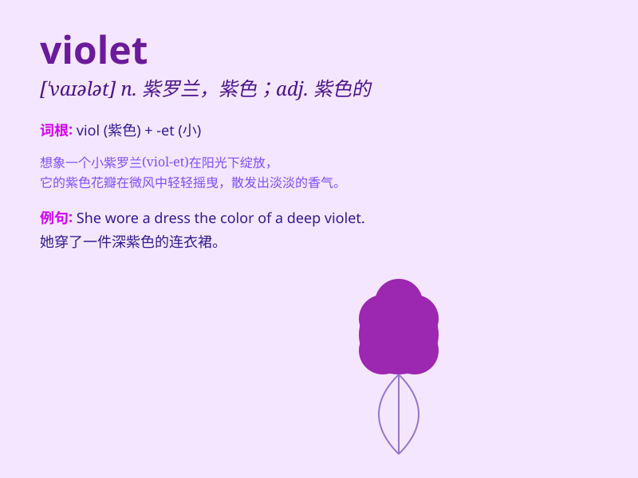

## violet

**英音:** _[\'vaɪələt]_ **美音:** _[\'vaɪələt]_

**译义:** *n.紫罗兰adj.紫罗兰色的 Violet 维奥莱特(女子名)*

### 短语

+ **violet eyes:** _紫罗兰色的眼睛_

+ **violet flower:** _紫罗兰花朵_

+ **violet dress:** _紫罗兰色的连衣裙_

+ **violet light:** _紫罗兰色的光_

+ **violet paint:** _紫罗兰色的颜料_

### 例句

#### 例句1

> **The violet flowers are very beautiful.**

**中文翻译:** 紫罗兰的花非常漂亮。

**单词释义:** 紫罗兰

#### 例句2

> **She wore a violet dress to the party.**

**中文翻译:** 她穿着一条紫罗兰色的连衣裙去参加聚会。

**单词释义:** 紫罗兰色

#### 例句3

> **The sky turned a violet hue at sunset.**

**中文翻译:** 日落时天空变成了紫罗兰色。

**单词释义:** 紫罗兰色

### 背诵小故事

>
在一个神秘的花园里，有一朵独特的花，它的颜色深深吸引了人们。大家都不知道它叫什么，后来一位智者说这是
violet 花，它的紫色如此迷人，就像夜空中闪烁的神秘星光。

**在一个神秘的花园里，有一朵独特的被称为 violet
的花，它的紫色很迷人，像夜空中的神秘星光。**

### 图义

