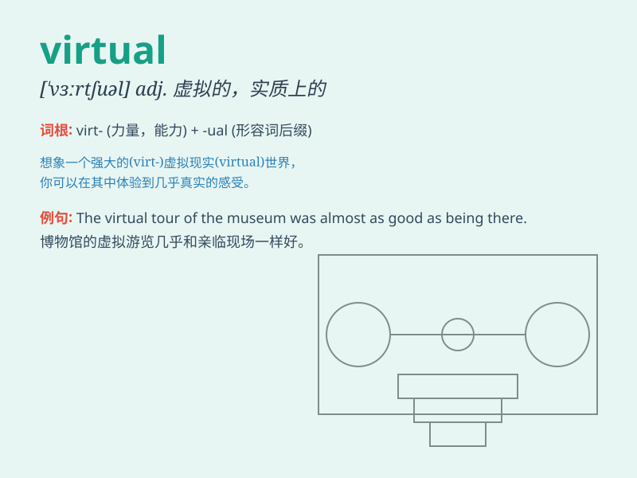

## virtual

**英音:** _[ˈvɜ:tʃuəl]_ **美音:** _[ˈvərtʃ(u)əl]_

**译义:** *adj.虚的,实质的,[物]有效的,事实上的*

### 短语

+ **virtual reality:** _虚拟现实_

+ **virtual machine:** _虚拟机_

+ **virtual memory:** _虚拟内存_

+ **virtual network:** _虚拟网络_

+ **virtual office:** _虚拟办公室_

### 例句

#### 例句1

> **The virtual reality game gives players an immersive
experience.**

**中文翻译:** 这款虚拟现实游戏给玩家带来身临其境的体验。

**单词释义:** 虚拟的

#### 例句2

> **She lives in a virtual world of her own imagination.**

**中文翻译:** 她生活在自己想象的虚拟世界里。

**单词释义:** 虚拟的

#### 例句3

> **The company has a virtual monopoly in this market.**

**中文翻译:** 这家公司在这个市场上几乎处于垄断地位。

**单词释义:** 实质上的；实际上的

### 背诵小故事

>
想象一个虚拟的世界，里面的人物看似真实，但其实都是由数字代码构成。在这个世界中，一切看似真实却又并非实体，这就是\'virtual\'所代表的虚拟、实质上的含义。

**想象一个关于'virtual'这个单词所表示的虚拟含义的故事**

### 图义

