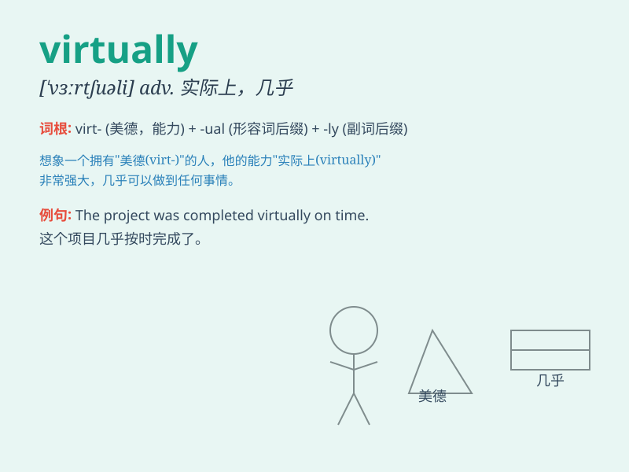

## virtually

**英音:** _[ˈvəːtʃʊəli]_ **美音:** _[ˈvɜrtʃuəli]_

**译义:** *adv.事实上,实质上*

### 短语

+ **virtually impossible:** _几乎不可能_

+ **virtually certain:** _几乎肯定_

+ **virtually everywhere:** _几乎无处不在_

+ **virtually unchanged:** _几乎未改变_

+ **virtually identical:** _几乎相同_

### 例句

#### 例句1

> **Virtually all students passed the exam.**

**中文翻译:** 几乎所有的学生都通过了考试。

**单词释义:** 几乎，差不多

#### 例句2

> **The city was virtually destroyed by the earthquake.**

**中文翻译:** 这座城市几乎被地震摧毁了。

**单词释义:** 几乎，差不多

#### 例句3

> **She is virtually always late for work.**

**中文翻译:** 她上班几乎总是迟到。

**单词释义:** 几乎，差不多

### 背诵小故事

> A virtual reality game player was trapped in a virtually impossible
level. But with determination, he found a way out. It shows that
\'virtually\' means almost or nearly, as if it were true but not quite.

**一位虚拟现实游戏玩家被困在一个几乎不可能的关卡中。但凭借决心，他找到了出路。这表明'virtually'意思是几乎、差不多，好像是真的但又不完全是。**

### 图义

