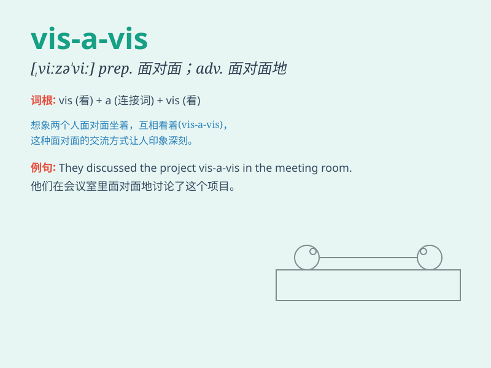

## vis-a-vis

**英音:** _[ˌvɪzəˈviː]_ **美音:** _[ˌvɪzəˈviː]_

**译义:** *prep. 面对面地；与...相比；adv. 面对面地；n.
面对面的谈话；对手*

### 短语

+ **vis-a-vis someone/something:** _与某人/某物相比_

+ **be vis-a-vis with:** _与\...\...面对面_

+ **stand vis-a-vis:** _处于相对的位置_

+ **sit vis-a-vis:** _相对而坐_

+ **position vis-a-vis:** _相对于\...\...的位置_

### 例句

#### 例句1

> **The new law is vis-a-vis the rights of citizens.**

**中文翻译:** 新的法律与公民的权利有关。

**单词释义:** 关于；对于

#### 例句2

> **She sat vis-a-vis me during the meeting.**

**中文翻译:** 在会议期间她坐在我对面。

**单词释义:** 面对面；相对

#### 例句3

> **His position vis-a-vis his colleagues is quite unique.**

**中文翻译:** 他相对于同事们的地位相当独特。

**单词释义:** 与\...相比

### 背诵小故事

>
想象一下，在一个盛大的舞会上，你站在舞池中央，对面（vis-a-vis）的舞伴与你相互凝视。你们的目光交汇，就像这个词所表达的'相对；关于'的意思。

**想象在舞会上与对面舞伴相互凝视的场景来辅助记忆 vis-a-vis
表示'相对；关于'的意思**

### 图义

